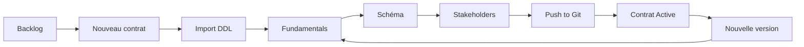

# Data Contract Builder (Zeenea DCB)

Application web pour **créer, éditer et publier des contrats de données** conformes à l’[Open Data Contract Standard (ODCS) v3.1.0](https://bitol-io.github.io/open-data-contract-standard/v3.1.0/). L’outil guide les équipes data à partir d’un DDL SQL jusqu’à un fichier YAML prêt à être versionné dans Git.

> Prototype / MVP orienté démonstration : persistance locale (`localStorage`), intégration Git simulée, utilisateur courant codé en dur.

---

## Sommaire

- [Fonctionnalités](#fonctionnalités)
- [Stack technique](#stack-technique)
- [Démarrage rapide](#démarrage-rapide)
- [Parcours utilisateur](#parcours-utilisateur)
- [Cycle de vie des contrats](#cycle-de-vie-des-contrats)
- [Import DDL](#import-ddl)
- [Génération YAML ODCS](#génération-yaml-odcs)
- [Collaboration et permissions](#collaboration-et-permissions)
- [Architecture du projet](#architecture-du-projet)
- [Spécification design](#spécification-design)
- [Déploiement](#déploiement)
- [Limitations connues](#limitations-connues)
- [Évolutions prévues](#évolutions-prévues)

---

## Fonctionnalités

| Domaine | Capacités |
|--------|-----------|
| **Backlog** | Liste des contrats, création, filtrage par statut, accès rapide à l’éditeur |
| **Import SQL** | Coller un ou plusieurs `CREATE TABLE` → schéma ODCS pré-rempli (colonnes, types, contraintes) |
| **Fundamentals** | Titre, ID, version SemVer, domaine, owner, description (purpose + contexte), tags |
| **Schéma** | Tables / vues, colonnes, types physiques & logiques, PK, PII, unicité, relations |
| **Stakeholders** | Propriétaires et parties prenantes (nom, rôle, email, équipe) |
| **YAML** | Aperçu en temps réel du contrat ODCS généré |
| **Versions** | Historique Git simulé, comparaison entre versions, abandon de brouillon |
| **Publication** | Bump major/minor, commit simulé, verrouillage du contrat actif |
| **Partage** | Collaborateurs avec rôles `owner` / `editor` / `viewer` |
| **Design system** | Page « Components » pour la bibliothèque UI interne |

---

## Stack technique

| Couche | Technologie |
|--------|-------------|
| Runtime UI | [React 19](https://react.dev/) |
| Build | [Vite 8](https://vite.dev/) |
| Langage | TypeScript 6 (strict) |
| Styles | [Tailwind CSS 4](https://tailwindcss.com/) + design tokens Actian |
| Composants | [Base UI](https://base-ui.com/) + composants maison (`src/components/ui/`) |
| YAML | [js-yaml](https://github.com/nodeca/js-yaml) |
| Icônes | [Lucide React](https://lucide.dev/) |
| Persistance | `localStorage` (clé `data-contracts-v1`) |

**Prérequis :** Node.js 18+ (recommandé 20+), npm.

---

## Démarrage rapide

```bash
# Cloner le dépôt puis, à la racine du projet :
npm install
npm run dev
```

L’application est servie par Vite (par défaut sur `http://localhost:5173`).

### Scripts disponibles

| Commande | Description |
|----------|-------------|
| `npm run dev` | Serveur de développement avec rechargement à chaud |
| `npm run build` | Compilation TypeScript + build de production (`dist/`) |
| `npm run preview` | Prévisualisation du build de production |

### Données de démonstration

Au premier chargement (ou si le stockage local est vide), l’application charge des **contrats seed** définis dans `src/lib/seedContracts.ts` (ex. *Customer Orders*, *Product Catalog*).

Pour réinitialiser les données : vider le `localStorage` du navigateur pour la clé `data-contracts-v1`, ou exécuter dans la console :

```js
localStorage.removeItem('data-contracts-v1')
location.reload()
```

### Utilisateur courant (prototype)

L’utilisateur connecté est simulé dans `src/lib/currentUser.ts` :

```ts
export const CURRENT_USER = {
  id: 'me',
  name: 'Florent Simon',
  email: 'florentsimon@gmail.com',
}
```

Modifier ce fichier pour tester les rôles et le partage sous un autre profil.

---

## Parcours utilisateur



1. **Backlog** — Créer un contrat ou ouvrir un existant.
2. **Import SQL** — Coller un `CREATE TABLE` ; le parseur remplit le dataset et propose un ID slugifié.
3. **Fundamentals** — Compléter titre, ID, owner, version, domaine, etc.
4. **Schéma** — Affiner libellés métier, types logiques, flags (PK, PII, required).
5. **Stakeholders** — Renseigner les parties prenantes.
6. **YAML** — Vérifier le rendu ODCS avant publication.
7. **Push to Git** — Choisir bump **minor** (non breaking) ou **major** (breaking) ; le contrat passe en statut `active` et devient en lecture seule.
8. **Nouvelle version** — Depuis un contrat actif, démarrer une révision (`inRevision`) pour éditer à nouveau.

---

## Cycle de vie des contrats

Trois statuts ODCS, reflétés dans l’UI par des badges et des règles d’édition :

| Statut | Comportement UI |
|--------|-----------------|
| `draft` | Édition complète ; publication possible si champs obligatoires remplis et modifications depuis le dernier publish |
| `active` | Lecture seule sauf mode révision (`inRevision`) ; bouton « New Version » |
| `deprecated` | Lecture seule ; bannière d’avertissement (versions historiques après un nouveau publish) |

### Versionnement (SemVer)

- **Minor** — Ajouts non breaking (ex. colonne optionnelle) → `x.(y+1).0`
- **Major** — Changements breaking (suppression, renommage, changement de type) → `(x+1).0.0`

La logique de bump est implémentée dans `src/components/PushToGitModal.tsx`.

### Publication (Git simulé)

La modale **Push to Git** :

1. Propose le choix du type de version.
2. Simule les étapes (validation, génération YAML, commit).
3. Ajoute une entrée dans `gitHistory` avec snapshot du contrat.
4. Marque les versions précédentes comme `deprecated` dans l’historique.

Convention de nom de fichier visée : `{contract_id}_{version}.yaml` (documentée dans `design.md`).

---

## Import DDL

Le parseur (`src/lib/ddlParser.ts`) accepte des instructions `CREATE TABLE` (avec ou sans `IF NOT EXISTS`, noms entre backticks ou guillemets).

| Élément SQL | Mapping ODCS / interne |
|-------------|------------------------|
| Nom de table | `physicalName`, `quantumName` (libellé lisible) |
| Nom de colonne | `physicalName`, `logicalName` (dérivé) |
| Type SQL | `physicalType` + `logicalType` |
| `NOT NULL` / `PRIMARY KEY` | `required`, `isPrimaryKey` |

### Correspondance des types

| Types SQL (exemples) | Libellé UI | Type logique |
|---------------------|------------|--------------|
| `VARCHAR`, `TEXT`, `CHAR` | Text | `string` |
| `INT`, `BIGINT`, `SMALLINT` | Whole Number | `integer` |
| `DECIMAL`, `FLOAT`, `DOUBLE` | Decimal Number | `number` |
| `TIMESTAMP`, `DATE`, `DATETIME` | Date & Time | `timestamp` / `date` |
| `BOOLEAN`, `BIT` | Yes/No | `boolean` |
| Type inconnu | — | `string` + flag `isUnknownType` |

Les contraintes de table (`PRIMARY KEY`, `FOREIGN KEY`, etc. en ligne séparée) sont ignorées ; seules les définitions de colonnes inline sont extraites.

---

## Génération YAML ODCS

Le module `src/lib/odcsYamlGenerator.ts` produit un document YAML aligné sur ODCS 3.1.0 :

- `apiVersion: v3.1.0`, `name` et `dataProduct` (depuis le titre du contrat)
- `id`, `version`, `status`, `domain`, objet `description` (purpose, usage, limitations, liens)
- `schema[]` avec `id` stable par table, `properties[]`, tags, quality, authoritativeDefinitions
- `quality[].id` sur les règles colonne et table
- `relationships` au niveau schéma pour les relations `many_to_many`
- `foreignKey` sur les propriétés pour les FK `belongs_to`

L’aperçu est disponible dans l’onglet **YAML** de l’éditeur (`YamlView`).

---

## Collaboration et permissions

| Rôle | Droits |
|------|--------|
| `owner` | Édition, publication, gestion des membres |
| `editor` | Édition (pas de publication) |
| `viewer` | Lecture seule ; bannière explicative |

La modale **Share** (`ShareModal`) permet d’ajouter ou modifier des collaborateurs sur un contrat.

---

## Architecture du projet

```
zeenea-dcb/
├── design.md                 # Spécification produit & design (référence)
├── index.html
├── package.json
├── vite.config.ts            # Alias @ → src/
├── tsconfig.json
├── .netlify/
│   └── netlify.toml          # Config build Netlify
└── src/
    ├── main.tsx
    ├── App.tsx               # État global, routing vues, orchestration
    ├── index.css             # Tokens Tailwind (Actian DS)
    ├── types/
    │   └── odcs.ts           # Types métier (DataContract, colonnes, Git, …)
    ├── lib/
    │   ├── ddlParser.ts      # SQL → SchemaTable
    │   ├── odcsYamlGenerator.ts
    │   ├── storage.ts        # load/save localStorage
    │   ├── seedContracts.ts  # Données de démo
    │   ├── currentUser.ts
    │   └── utils.ts
    ├── components/
    │   ├── sections/         # Import, Fundamentals, Schema, Stakeholders
    │   ├── schema/           # TableBlock, TypePicker, FlagBadge
    │   ├── ui/               # Design system (Button, Dialog, Input, …)
    │   ├── ContractsBacklog.tsx
    │   ├── ContractTopBar.tsx
    │   ├── PushToGitModal.tsx
    │   ├── VersionCompareModal.tsx
    │   └── …
    └── pages/
        └── ComponentsPage.tsx
```

### Vues applicatives

| Vue (`AppView`) | Description |
|-----------------|-------------|
| `backlog` | Liste des contrats |
| `editor` | Éditeur multi-sections d’un contrat |
| `components` | Galerie des composants UI |

### Sections de l’éditeur (`SectionId`)

`import` → `fundamentals` → `schema` → `versions` (+ `stakeholders` via navigation latérale selon configuration).

---

## Spécification design

Le fichier [`design.md`](./design.md) décrit en détail :

- **Identité visuelle** — Minimalisme enterprise, palette Actian (neutres, bleu action, statuts vert / ambre / rouge)
- **Layout** — Sidebar navigation, barre de statut contrat, zone de contenu centrée
- **Composants** — Tables denses, modales, empty states DDL
- **Règles UX** — Libellés métier vs termes techniques, verrouillage des contrats actifs
- **Moteur ODCS** — Mapping DDL, validation avant publish
- **Workflow Git** — Draft → Publish → New Version

L’implémentation UI suit le **design system Actian** (tokens dans `src/index.css`), avec une inspiration Shadcn/Radix mentionnée dans la spec produit.

---

## Déploiement

Le projet inclut une configuration Netlify (`.netlify/netlify.toml`) :

```toml
[build]
command = "npm run build"
publish = "dist"
```

> Vérifier que `publish` pointe bien vers `dist` (et non un chemin absolu local) avant un déploiement en production.

Build statique : aucune API backend requise pour le MVP.

---

## Limitations connues

- **Pas de backend** — Données et historique Git uniquement côté navigateur.
- **Git simulé** — Pas de connexion réelle à GitHub/GitLab ; commits et hash générés localement.
- **Authentification** — Utilisateur fixe ; pas de SSO.
- **Parseur DDL** — Sous-ensemble SQL ; import multi-tables supporté, mais pas de vues complexes ni dialectes exotiques.
- **ODCS partiel** — Sections `terms`, `servers`, `pricing`, etc. non implémentées ; SLA et rôles d’accès partiels.
- **Relations** — Seuls `belongs_to` et `many_to_many` sont proposés à la création et exportés en YAML ; d’anciens types `has_one` / `has_many` restent visibles avec le badge « Not exported ».
- **Shared components** — Pas de `customProperties` UI, pas de picker Zeenea ; quality en langage naturel (type text), pas de règles SQL/métriques.

---

## Évolutions prévues

Alignées sur `design.md` et l’architecture actuelle :

- [ ] Connexion Git réelle (commit, branches draft/main)
- [ ] Authentification plateforme Zeenea / Actian
- [ ] Validation ODCS complète (schéma Bitol)
- [ ] Sections ODCS additionnelles (SLA, quality, servers)
- [ ] Dialectes SQL étendus et contraintes de table (PK/FK hors colonnes)
- [ ] API de persistance et collaboration temps réel
- [ ] Tests unitaires (parseur DDL, générateur YAML, règles de lifecycle)

---

## Licence

ISC (voir `package.json`). Contacter l’équipe propriétaire du dépôt pour les conditions d’usage en entreprise.

---

## Ressources

- [Open Data Contract Standard v3.1.0](https://bitol-io.github.io/open-data-contract-standard/v3.1.0/)
- [Spécification design du projet](./design.md)
