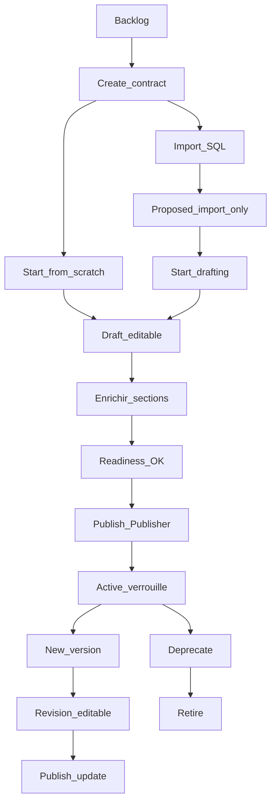

# Changelog fonctionnel - Data Contract Builder MVP

**Périmètre :** évolution du dépôt entre le commit initial `9bf13d8` (_Initial commit_) et `262c3bc` (_Update documentation and logic for ODCS P1 reference and governance changes_) - 87 commits, sans détail commit-par-commit.

**Produit :** prototype **Data Contract Builder** (anciennement « Data Contract Studio » dans les premières itérations) - application web de création et maintenance de contrats de données alignés sur **ODCS v3.1.0**.

---

## 1. Résumé exécutif

En quelques semaines d’itération, le projet est passé d’un **prototype React déjà navigable** (backlog, éditeur, import SQL basique, publication simulée, YAML) à un **MVP métier structuré** couvrant le parcours complet : création sans persistance prématurée, import multi-tables, enrichissement par sections, indicateur de maturité, publication versionnée et livrable YAML prêt pour un dépôt Git.

**Ce qui a été construit :**

- Un studio de contrats **frontend-only** (persistance navigateur, pas de backend ni SSO).
- Un modèle aligné sur **55 champs ODCS P1** + champs schema P0 exportés, avec validation avant publication.
- Un **cycle de vie** à cinq statuts (`proposed` → `draft` → `active` → `deprecated` → `retired`) et des règles de verrouillage cohérentes.
- Des sections métier : identité, schéma, contacts de gouvernance, accès données, SLA, propriétés personnalisées, historique de versions.
- Une **gouvernance hybride** : le YAML ODCS reste la livraison standard ; l’application conserve et versionne certains champs opérationnels (owner, contacts) hors export.

**Positionnement actuel :** démonstrateur crédible pour data stewards, ingénieurs data et gouvernance - utilisable en atelier produit et en QA - avec limites assumées (Git simulé, parseur DDL partiel, pas de moteur qualité réel).

---

## 2. Évolution fonctionnelle par domaine

### 2.1 Initialisation du prototype

|                   |                                                                                                                                                                                                                                                                                               |
| ----------------- | --------------------------------------------------------------------------------------------------------------------------------------------------------------------------------------------------------------------------------------------------------------------------------------------- |
| **Ajouté**        | Application React + TypeScript + Vite + Tailwind ; backlog de contrats ; éditeur multi-sections ; onglets Form / YAML ; panneau readiness ; modales publication / comparaison / partage ; persistance `localStorage` ; contrats de démonstration au premier chargement ; déploiement Netlify. |
| **Évolué**        | Documentation produit dédiée (`docs/product-documentation.md`), référence P1, notes techniques ; règles Cursor (projet, UI Kit, React) ; galerie UI Kit (`ComponentsPage`).                                                                                                                   |
| **Valeur métier** | Socle démontrable dès le premier commit : montrer la vision « contrat de données versionné » sans attendre un backend.                                                                                                                                                                        |
| **Statut actuel** | Prototype installable et déployable ; données locales réinitialisables.                                                                                                                                                                                                                       |

### 2.2 Parcours de création / import SQL

|                   |                                                                                                                                                                                                                                                                     |
| ----------------- | ------------------------------------------------------------------------------------------------------------------------------------------------------------------------------------------------------------------------------------------------------------------- |
| **Ajouté**        | Écran **Create contract** dédié : aucun contrat enregistré tant que l’utilisateur n’a pas choisi **Start from scratch** ou validé un import. Import → statut `proposed` ; scratch → `draft` direct. Fichier `demo.sql` riche pour la QA (multi-tables, FK variées). |
| **Évolué**        | Parseur DDL : une table → **plusieurs tables** ; détection des **clés étrangères** et affichage des relations ; barre de progression à l’import (durée fixe, indicative). Section Import masquée après parcours manuel. UX Create en **deux étapes** : cartes de choix (_Import DDL_ / _Start from scratch_) puis formulaire DDL (`CreateContractView`, `ImportSection` layout `creation`, retour **Back to creation options**). Libellés dans `uxCopy.ts`. |
| **Valeur métier** | Sépare clairement l’intention de création de la persistance ; reflète le métier « je pars du DDL existant » vs « je construis from scratch ».                                                                                                                       |
| **Statut actuel** | Parcours documenté et testé ; parseur limité au sous-ensemble SQL `CREATE TABLE` (voir §7).                                                                                                                                                                         |

### 2.3 Fundamentals / identité du contrat

|                   |                                                                                                                                                                                                                                      |
| ----------------- | ------------------------------------------------------------------------------------------------------------------------------------------------------------------------------------------------------------------------------------ |
| **Ajouté**        | Identifiant hybride P1 `{slug}-{8hex}` stable ; contract owner obligatoire à la publication (non exporté YAML). Champs `id` et `version` en lecture seule dans l’UI ; `apiVersion` / `kind` visibles dans l’export YAML uniquement.  |
| **Évolué**        | Passage des IDs « slug seul » legacy vers le format hybride avec migration au chargement ; unicité de l’`id` vérifiée localement à la publication. Nom de contrat requis côté produit (ODCS `name` optionnel mais bloquant publish). |
| **Valeur métier** | Identité lisible et collision-safe pour un futur registry ; distinction claire entre responsable métier (owner) et identité technique exportée.                                                                                      |
| **Statut actuel** | Aligné référence P1 et golden tests d’export.                                                                                                                                                                                        |

### 2.4 Schema / tables / champs

|                   |                                                                                                                                                                                                                                                                                                                                                                                         |
| ----------------- | --------------------------------------------------------------------------------------------------------------------------------------------------------------------------------------------------------------------------------------------------------------------------------------------------------------------------------------------------------------------------------------- |
| **Ajouté**        | Dialogues avancés table/colonne : tags, règles de qualité, reference links (catalogue Zeenea mock). Libellés **Entity name** / **Business label** exportés en `businessName`. Indicateurs FK inline ; documentation des relations ; types `has_one` / `has_many` visibles mais non exportés. **Classification** ODCS (`public` / `restricted` / `confidential`) avec cycle UI et badge. |
| **Évolué**        | Mapping centralisé app → ODCS (noms logiques, PK, unique, CDE, `logicalType`) ; blocage publish si type `unknown` ; sync personal data → `confidential`. IDs stables table/propriété pour références FK.                                                                                                                                                                                |
| **Valeur métier** | Le schéma importé devient un contrat documenté, gouverné et consommable - pas seulement une liste de colonnes techniques.                                                                                                                                                                                                                                                               |
| **Statut actuel** | Cœur de l’éditeur ; relations FK exportées quand complètes ; liens vers tables absentes du script peuvent rester incomplets.                                                                                                                                                                                                                                                            |

### 2.5 Conformité ODCS P0 / P1

|                   |                                                                                                                                                                                                       |
| ----------------- | ----------------------------------------------------------------------------------------------------------------------------------------------------------------------------------------------------- |
| **Ajouté**        | Référence Excel ODCS v3.1.0 ; annexe **55 champs P1** ; validateurs atomiques (`p1Validation`) et orchestration publish (`contractValidation`) ; test de conformité golden (`p1-compliance.test.ts`). |
| **Évolué**        | Renforcement progressif : SLA `property` obligatoire sur ligne non vide ; rôles IAM avec `role` requis ; quality rules **text-only** ; passage documenté de 54 à 55 champs P1 (SLA).                  |
| **Valeur métier** | Crédibilité face aux équipes conformité et consommateurs ODCS ; base pour extension P2+.                                                                                                              |
| **Statut actuel** | P1 UI + export couverts ; sections ODCS hors P1 non éditables (terms, servers, pricing, etc.).                                                                                                        |

### 2.6 Export YAML ODCS v3.1.0

|                   |                                                                                                                                                                            |
| ----------------- | -------------------------------------------------------------------------------------------------------------------------------------------------------------------------- |
| **Ajouté**        | Générateur YAML temps réel ; onglet YAML avec rappel export vs app-only ; export relations via module dédié ; omission des clés vides (omit-if-false sur booléens schema). |
| **Évolué**        | Exclusion explicite de `dataProduct` ; normalisation des noms ; filtrage des lignes SLA/rôles partielles ; qualité et reference links sur tables/colonnes/fundamentals.    |
| **Valeur métier** | Livrable standardisé pour CI/CD, catalogues et consommateurs - objectif « fichier prêt pour Git ».                                                                         |
| **Statut actuel** | `apiVersion: v3.1.0`, `kind: DataContract` ; convention de nom de fichier `{id}_{version}.yaml`.                                                                           |

### 2.7 Validation publication / readiness

|                   |                                                                                                                                                                                                                                                                     |
| ----------------- | ------------------------------------------------------------------------------------------------------------------------------------------------------------------------------------------------------------------------------------------------------------------- |
| **Ajouté**        | Score readiness **70 % obligatoire / 25 % qualité champs / 5 % suggestions** ; navigation guidée vers les champs manquants ; messages utilisateur centralisés (`validationUserMessages`). Après publication : panneau **Contract quality** (amélioration continue). |
| **Évolué**        | Remplacement de validations ad hoc par `computePublicationReadiness` ; inclusion des rôles data access dans les checks recommandés ; avertissement non bloquant si PII sans governance contact.                                                                     |
| **Valeur métier** | Réduit les publications incomplètes ; guide les équipes vers la maturité avant verrouillage.                                                                                                                                                                        |
| **Statut actuel** | Publish bloqué si erreurs ; suggestions distinctes de la qualité des descriptions de champs.                                                                                                                                                                        |

### 2.8 Lifecycle / statuts / verrouillage

|                   |                                                                                                                                                                                                     |
| ----------------- | --------------------------------------------------------------------------------------------------------------------------------------------------------------------------------------------------- |
| **Ajouté**        | Statut **`proposed`** (import) avec **Start drafting** ; statuts **`retired`** et transitions linéaires ; bannières contextuelles proposed ; helpers `isContractLocked`, `isImportSectionEditable`. |
| **Évolué**        | De trois statuts initiaux (`draft` / `active` / `deprecated`) vers cinq statuts P1 ; publish impossible en `proposed` ; exception : section Import éditable en `proposed`.                          |
| **Valeur métier** | Modélise la reprise d’un DDL importé avant édition complète ; aligne l’UI sur le vocabulaire ODCS `status`.                                                                                         |
| **Statut actuel** | Matrice rôles × statuts documentée pour QA ; Deprecate / Retire réservés au Publisher.                                                                                                              |

### 2.9 Versioning / changelog / diff

|                   |                                                                                                                                                                                                                                                  |
| ----------------- | ------------------------------------------------------------------------------------------------------------------------------------------------------------------------------------------------------------------------------------------------ |
| **Ajouté**        | Snapshots locaux à chaque publication ; bump SemVer **minor/major** (sauf première publication) ; diff contenu exportable ; changelog publish avec titre ; résumé **Working copy** ; **Option B** : publication si seul owner/contacts changent. |
| **Évolué**        | Comparaison **Compare** limitée au YAML exportable ; changements gouvernance visibles dans changelog / Versions, pas dans Compare ; pas de publication vide (_No changes to publish_).                                                           |
| **Valeur métier** | Traçabilité des évolutions contractuelles même sans Git réel ; honnêteté sur ce qui part en repo vs ce qui reste opérationnel.                                                                                                                   |
| **Statut actuel** | Historique app-only ; anciennes entrées marquées deprecated dans la timeline locale.                                                                                                                                                             |

### 2.10 Data access roles

|                   |                                                                                                                   |
| ----------------- | ----------------------------------------------------------------------------------------------------------------- |
| **Ajouté**        | Section **Data access** : rôles IAM consommateurs (`roles` dans YAML) - nom, accès read/write, description.       |
| **Évolué**        | Validation publish sur lignes incomplètes ; placeholders ignorés ; export uniquement si `role` renseigné.         |
| **Valeur métier** | Documente _comment_ un consommateur accède aux données - distinct des droits dans l’application (collaborateurs). |
| **Statut actuel** | Export `roles` omis si aucune ligne exportable.                                                                   |

### 2.11 SLA

|                   |                                                                                                                                          |
| ----------------- | ---------------------------------------------------------------------------------------------------------------------------------------- |
| **Ajouté**        | Section **Service levels** : 13 types Data QoS (`latency`, `retention`, `frequency`, etc.), valeur, unité, élément, driver, description. |
| **Évolué**        | `property` + `value` requis dès qu’une ligne contient du contenu ; lignes partielles absentes du YAML preview.                           |
| **Valeur métier** | Formalise les engagements de fraîcheur, disponibilité et conformité rattachés au contrat.                                                |
| **Statut actuel** | Pas de validation de format de valeur par type (texte libre MVP).                                                                        |

### 2.12 Custom properties

|                   |                                                                                                        |
| ----------------- | ------------------------------------------------------------------------------------------------------ |
| **Ajouté**        | Section **Custom** et export YAML `customProperties` (nom camelCase, valeur, description optionnelle). |
| **Évolué**        | Composants gouvernance partagés (table, footer, suppression).                                          |
| **Valeur métier** | Extensibilité ODCS sans modifier le schéma standard.                                                   |
| **Statut actuel** | Exportées - contrairement à owner et governance contacts.                                              |

### 2.13 Governance contacts

|                   |                                                                                                                                                                                        |
| ----------------- | -------------------------------------------------------------------------------------------------------------------------------------------------------------------------------------- |
| **Ajouté**        | Section **Governance contacts** (ex-Stakeholders) : nom, rôle, email, équipe, notes.                                                                                                   |
| **Évolué**        | Clarification terminologique (operational governance vs contract owner vs collaborateurs) ; **snapshot à la publication** et diff dans changelog ; **non exportés** dans le YAML ODCS. |
| **Valeur métier** | Point de contact privacy/stewardship sans polluer le fichier standard ; recommandé si données personnelles.                                                                            |
| **Statut actuel** | App-only mais versionnés pour publish (Option B).                                                                                                                                      |

### 2.14 Collaborators

|                   |                                                                                                                                         |
| ----------------- | --------------------------------------------------------------------------------------------------------------------------------------- |
| **Ajouté**        | Rôles applicatifs **Publisher / Contributor / Reader** (ex-owner/editor/viewer) ; modale partage ; annuaire fictif.                     |
| **Évolué**        | Droits affinés : seul Publisher publie, gère membres, modifie owner, deprecate/retire ; Contributor peut New version et Start drafting. |
| **Valeur métier** | Simule la gouvernance d’équipe sur le contrat dans l’outil, indépendamment des rôles IAM exportés.                                      |
| **Statut actuel** | **Non exportés** ; **non versionnés** dans le snapshot publish (ne déclenchent pas seuls une nouvelle version).                         |

### 2.15 UX / UI / design system / read-only

|                   |                                                                                                                                                                                                                                                           |
| ----------------- | --------------------------------------------------------------------------------------------------------------------------------------------------------------------------------------------------------------------------------------------------------- |
| **Ajouté**        | Composants gouvernance réutilisables (en-têtes, états vides, lecture seule compacte, `docCompact`) ; panneau readiness épinglé / overlay selon viewport ; navigation readiness ; badges lifecycle ; filtres backlog ; messages UX centralisés (`uxCopy`). |
| **Évolué**        | Passe « visual calm » readiness ; harmonisation tons neutres ; règles **UI Kit source of truth** (primitives protégées, convergence app → kit). Vues read-only Fundamentals, metadata modales, governance verrouillée.                                    |
| **Valeur métier** | Réduit la charge cognitive sur formulaires denses ; cohérence visuelle pour démos client.                                                                                                                                                                 |
| **Statut actuel** | UI Kit (`ComponentsPage`, `src/components/ui/*`) traité comme référence - modifications kit sur demande explicite.                                                                                                                                        |

### 2.16 Documentation / tests / qualité

|                   |                                                                                                                                                                                                                            |
| ----------------- | -------------------------------------------------------------------------------------------------------------------------------------------------------------------------------------------------------------------------- |
| **Ajouté**        | Documentation produit (~1000 lignes), référence P1, notes techniques, scénarios QA ; **19 fichiers de tests**, **242 tests** Vitest (conformité P1, lifecycle, YAML, DDL, migrations, readiness, IDs, gouvernance layout). |
| **Évolué**        | `design.md` allégé au profit de `docs/` ; README orienté MVP ; migrations `localStorage` (lifecycle, IDs, SLA, quality[], schema IDs).                                                                                     |
| **Valeur métier** | Onboarding PM/QA/client sans lire le code ; filet de non-régression sur règles métier critiques.                                                                                                                           |
| **Statut actuel** | Pas de tests composants React ni e2e navigateur.                                                                                                                                                                           |

---

## 3. Principales décisions produit

| Décision                                   | Choix retenu                                                                                                                                                    | Impact métier                                                                                                                      |
| ------------------------------------------ | --------------------------------------------------------------------------------------------------------------------------------------------------------------- | ---------------------------------------------------------------------------------------------------------------------------------- |
| **ODCS strict vs gouvernance app-only**    | Le YAML = livraison standard (identité, schema, roles, SLA, custom, tags, qualité, reference links). Owner, contacts, collaborateurs, historique = application. | Les consommateurs ODCS ne reçoivent pas de champs hors standard ; l’équipe garde la responsabilité opérationnelle dans l’outil.    |
| **Contacts gouvernance app-only**          | Non exportés YAML ; **snapshotés** à la publication.                                                                                                            | Privacy/stewardship traçable en interne sans étendre le schéma ODCS.                                                               |
| **Option B - publish YAML ou gouvernance** | Publication autorisée si seuls owner ou governance contacts changent (YAML exportable identique).                                                               | Évite les publications « fantômes » tout en permettant de corriger la responsabilité sans toucher au schéma.                       |
| **Git simulé**                             | Push/commit = verrouillage + entrée historique locale ; message _External repository sync is not connected in this prototype_.                                  | Workflow mental Git sans dépendance infra ; limite explicite pour les PO.                                                          |
| **Quality rules text-only**                | Seul le type `text` est accepté à la publication ; toggle « AI verified » = mock local.                                                                         | Positionnement « expression métier » sans moteur DQ branché.                                                                       |
| **Classification / PII**                   | `classification` exportée si `restricted` ou `confidential` ; flag **personal data** (`isPII`) synchronise vers `confidential` mais **n’est pas exporté**.      | Conformité ODCS sur la sensibilité sans dupliquer un flag propriétaire dans le YAML.                                               |
| **Custom properties exportées**            | Présentes dans `customProperties` YAML.                                                                                                                         | Extensions métier partageables avec les consommateurs du fichier.                                                                  |
| **Collaborateurs non versionnés**          | Changement de membres seul ≠ nouvelle version publish.                                                                                                          | Évite le bruit de version sur la gouvernance d’accès à l’outil.                                                                    |
| **Compare = export only**                  | Modale Compare ne montre pas owner/contacts.                                                                                                                    | Évite la confusion « le YAML n’a pas changé » alors que la gouvernance interne a évolué - le changelog publish porte cette vérité. |
| **ID hybride (non UUID pur)**              | `{slug}-{8hex}` dérivé du nom + suffixe stable.                                                                                                                 | Lisibilité humaine + unicité locale ; écart assumé vs exemple UUID Excel P1.                                                       |
| **`dataProduct` absent**                   | Non réintroduit à l’export.                                                                                                                                     | Périmètre MVP centré contrat dataset classique.                                                                                    |

---

## 4. Couverture ODCS

### 4.1 Champs P0 / P1 couverts

- **55 propriétés P1** documentées dans `docs/odcs-p1-reference.md` (fundamentals, schema, roles, SLA, quality, authoritative definitions, tags, custom properties).
- **Champs schema P0** exportés : `name`, `physicalType`, `businessName`, `logicalType`, `primaryKey`, `classification`, `unique`, `criticalDataElement`, relations `foreignKey`.
- **Règles produit au-delà d’ODCS** : `name` (titre contrat) et contract owner requis pour publier ; `unknown` logicalType bloqué.

### 4.2 Sections exportées dans le YAML

| Section YAML         | Contenu principal                                                                        |
| -------------------- | ---------------------------------------------------------------------------------------- |
| Racine               | `apiVersion`, `kind`, `id`, `version`, `status`, `name`, `domain`, `description`, `tags` |
| `schema[]`           | Tables, propriétés, qualité, tags, reference links, relations FK exportables             |
| `roles[]`            | Rôles IAM consommateurs                                                                  |
| `slaProperties[]`    | Engagements Data QoS                                                                     |
| `customProperties[]` | Extensions nom/valeur                                                                    |

### 4.3 Sections et champs app-only

| Élément                                          | Raison                                        |
| ------------------------------------------------ | --------------------------------------------- |
| Contract owner                                   | Responsabilité métier interne                 |
| Governance contacts                              | Contacts opérationnels (privacy, support)     |
| Collaborators (Publisher / Contributor / Reader) | Droits dans l’application                     |
| Historique des versions                          | Snapshots locaux, pas le fichier YAML courant |
| `creationSource`, `inRevision`, working copy     | État de workflow prototype                    |
| `isPII` (brut), `aiVerified` sur qualité table   | UI / mock ; non dans le contrat machine       |
| IDs internes SLA/rôles (P2)                      | Non exposés MVP                               |

### 4.4 Exclusions assumées

- **`dataProduct`** et sections ODCS hors P1 UI : terms, servers, pricing, collaboration ODCS, tests automatisés du contrat, etc.
- **Relations** `has_one` / `has_many` : visibles en UI, badge _Not in exported contract_.
- **Validation schéma Bitol complète** : non branchée (export aligné implémentation prototype).

---

## 5. UX / parcours utilisateur

### Parcours final (happy path)

| Étape             | Comportement clé                                                                                    |
| ----------------- | --------------------------------------------------------------------------------------------------- |
| **Création**      | Backlog → Create : choix (cartes) → import DDL ou draft immédiat ; pas de contrat en liste tant qu’aucun parcours terminé. |
| **Import**        | DDL multi-tables → `proposed` ; Import seul éditable jusqu’à Start drafting.                        |
| **Édition**       | Fundamentals → Schema → Contacts → Data access → SLA → Custom ; panneau readiness sur Form.         |
| **Readiness**     | Score /100 ; navigation vers champs manquants ; publish bloqué si erreurs.                          |
| **Publication**   | Publisher ; première fois version Fundamentals ; ensuite minor/major ; contrat `active` verrouillé. |
| **Versions**      | Timeline ; Working copy ; Compare (YAML) ; Discard changes.                                         |
| **Lecture seule** | Reader ; `active` sans révision ; `deprecated` / `retired` ; bannières explicatives.                |

---

## 6. Qualité / tests / robustesse

| Domaine                     | Détail                                                                                                                                                                                                        |
| --------------------------- | ------------------------------------------------------------------------------------------------------------------------------------------------------------------------------------------------------------- |
| **Tests unitaires**         | 19 fichiers, **242 tests** passants (`npm test`) - conformité P1 golden YAML, lifecycle, validation publish, export YAML, DDL→ODCS, migrations storage, readiness, IDs hybrides, diff relations, messages UI. |
| **Build**                   | `npm run build` (TypeScript strict + Vite production).                                                                                                                                                        |
| **Validations**             | Couches `p1Validation` → `contractValidation` → readiness ; messages utilisateur mappés.                                                                                                                      |
| **Migrations localStorage** | Statuts lifecycle ; ID hybride ; `slaProperties[].property` ; `quality[]` ; IDs stables schema ; commits Git history.                                                                                         |
| **Non-régressions**         | Tests ciblés sur chaque arbitrage publish (proposed bloqué, quality text-only, rôles partiels, Option B gouvernance via diff/changelog).                                                                      |
| **Limites QA**              | Pas de tests React composants ni parcours e2e navigateur automatisés.                                                                                                                                         |

---

## 7. Limites MVP restantes

| Limite                       | Description                                                                                                              |
| ---------------------------- | ------------------------------------------------------------------------------------------------------------------------ |
| **Pas de backend**           | Données et historique uniquement dans le navigateur (`localStorage`).                                                    |
| **Authentification fictive** | Utilisateur courant codé en dur ; annuaire d’invitation mock.                                                            |
| **Git simulé**               | Aucun push vers GitHub/GitLab ; unicité des `id` vérifiée localement.                                                    |
| **Parseur DDL partiel**      | Sous-ensemble `CREATE TABLE` ; types inconnus → `string` + flag ; FK incomplètes si table absente du script.             |
| **Pas de moteur DQ réel**    | Règles qualité en langage naturel ; « AI verified » = toggle local.                                                      |
| **Compare gouvernance**      | Modale Compare = contenu exportable uniquement ; écarts owner/contacts dans changelog / Versions.                        |
| **Registry global**          | Pas d’API d’unicité inter-organisation des identifiants.                                                                 |
| **Catalogue Zeenea**         | Quelques entrées d’exemple pour reference links.                                                                         |
| **Approval in progress**     | Mention UI possible ; **aucun flux d’approbation actif**.                                                                |
| **Persistance fragile**      | Quota `localStorage` ; échec de sauvegarde silencieux si quota dépassé ; pas de version explicite du schéma JSON stocké. |
| **Sections ODCS hors P1**    | Non éditables dans ce prototype.                                                                                         |

### À confirmer

- Date exacte du commit initial (non portée par les métadonnées analysées ici).
- Périmètre futur d’intégration Zeenea/Actian (hors code MVP actuel).

---

## 8. Synthèse finale

Le **Data Contract Builder MVP** est un prototype **métier abouti** : il permet de créer, enrichir, valider et « publier » des contrats de données alignés sur **ODCS v3.1.0 P1**, avec un fichier YAML crédible et un discours produit clair sur ce qui est livré vs ce qui reste dans l’application.

Les **87 commits** ont surtout renforcé la **conformité**, la **gouvernance hybride** (Option B), le **parcours import/proposed**, l’**expérience readiness** et la **documentation/testabilité** - plus qu’ils n’ont inventé le concept initial, déjà présent au premier commit.

**Prochaines étapes possibles (hors MVP) :** connexion Git réelle, authentification plateforme, validateur schéma ODCS complet, dialectes SQL étendus, moteur qualité branché, persistance API et collaboration temps réel.

---

## Annexe - Synthèse par domaine

| Domaine             | Fonctionnalités livrées                                    | Impact métier                         |
| ------------------- | ---------------------------------------------------------- | ------------------------------------- |
| Initialisation      | Backlog, éditeur, YAML, persistance locale, seeds démo     | Démo immédiate sans infra             |
| Création / import   | Vue Create, multi-tables, FK, `proposed` / `draft`         | Alignement parcours DDL vs greenfield |
| Fundamentals        | ID hybride, owner, domaine, descriptions, tags             | Identité contractuelle traçable       |
| Schema              | Tables/colonnes, classification, relations, qualité, liens | Documentation consommable du dataset  |
| ODCS P1             | 55 champs, validation publish                              | Crédibilité standard ouvert           |
| Export YAML         | ODCS v3.1.0 temps réel                                     | Livrable Git-ready                    |
| Readiness           | Score 70/25/5, guidance                                    | Maturité avant publication            |
| Lifecycle           | 5 statuts, verrouillage                                    | Gouvernance du cycle de vie données   |
| Versioning          | Snapshots, SemVer, changelog, Option B                     | Traçabilité des évolutions            |
| Data access         | Rôles IAM `roles`                                          | Consommation sécurisée documentée     |
| SLA                 | 13 types Data QoS                                          | Engagements formalisés                |
| Custom properties   | Export `customProperties`                                  | Extensibilité standard                |
| Governance contacts | App-only versionnés                                        | Privacy / stewardship interne         |
| Collaborators       | Publisher / Contributor / Reader                           | Travail d’équipe dans l’outil         |
| UX / UI             | Readiness responsive, read-only, UI Kit                    | Adoption et démos client              |
| Qualité             | 242 tests, doc produit                                     | Confiance et onboarding               |

---

_Document généré à partir de l’historique Git (`9bf13d8`…`262c3bc`), de la documentation produit et des tests du dépôt - mai 2026._
