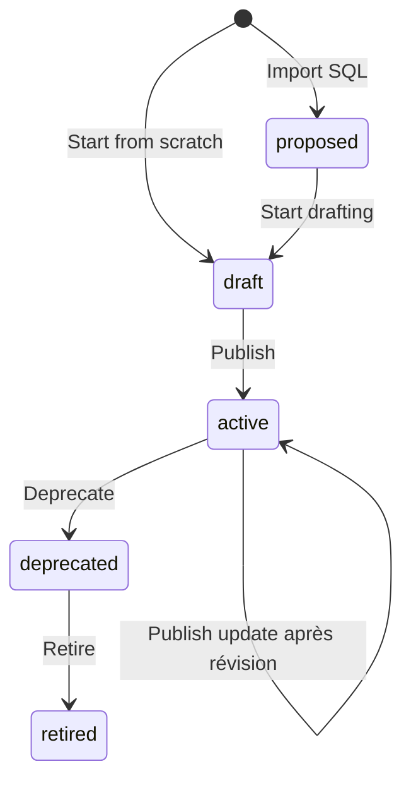
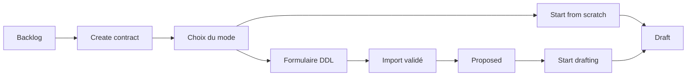

# Documentation produit - Data Contract Builder (prototype MVP)

Documentation fonctionnelle et métier du prototype **Data Contract Builder**. Elle décrit ce que fait le produit, pour qui, et selon quelles règles - sans détail d’implémentation technique.

**Annexes :**

- [Référence ODCS P1](./odcs-p1-reference.md) - 55 champs prioritaires
- [Notes techniques développeurs](./technical-notes.md) - persistance, tests, architecture code

---

## Comment lire ce document

| Profil                           | Sections recommandées                                                                                                                                                                                                                                                                                        | Durée indicative |
| -------------------------------- | ------------------------------------------------------------------------------------------------------------------------------------------------------------------------------------------------------------------------------------------------------------------------------------------------------------ | ---------------- |
| **Client / PO**                  | [1](#1-introduction) → [2](#2-concepts-métier-essentiels) → [3](#3-vue-densemble-du-produit) → [4](#4-rôles-permissions-et-lecture-seule) → [12](#12-limitations-du-prototype-mvp) → [13](#13-évolutions-envisagées)                                                                                         | 25–35 min        |
| **PM**                           | [1](#1-introduction) → [2](#2-concepts-métier-essentiels) → [4](#4-rôles-permissions-et-lecture-seule) → [5](#5-cycle-de-vie-du-contrat) → [6](#6-workflows-utilisateur) → [9](#9-publication-et-readiness) → [10](#10-versionnement-et-historique) → [12](#12-limitations-du-prototype-mvp)                 | 45–60 min        |
| **Designer**                     | [1](#1-introduction) → [4](#4-rôles-permissions-et-lecture-seule) → [5](#5-cycle-de-vie-du-contrat) → [6](#6-workflows-utilisateur) → [11](#11-fichier-yaml-et-positionnement-odcs) → [14](#14-principes-ux-et-rédaction)                                                                                    | 30–40 min        |
| **QA**                           | [4](#4-rôles-permissions-et-lecture-seule) → [5](#5-cycle-de-vie-du-contrat) → [6](#6-workflows-utilisateur) → [7](#7-création-et-import-sql) → [8](#8-édition-du-contrat-par-section) → [9](#9-publication-et-readiness) → [10](#10-versionnement-et-historique) → [15](#15-scénarios-de-référence-pour-qa) | 50–70 min        |
| **Développeur (lecture métier)** | [1](#1-introduction) → [4](#4-rôles-permissions-et-lecture-seule) → [7](#7-création-et-import-sql) → [9](#9-publication-et-readiness) → [12](#12-limitations-du-prototype-mvp) + [notes techniques](./technical-notes.md)                                                                                    | ~40 min          |

---

## Sommaire

1. [Introduction](#1-introduction)
2. [Concepts métier essentiels](#2-concepts-métier-essentiels)
3. [Vue d’ensemble du produit](#3-vue-densemble-du-produit)
4. [Rôles, permissions et lecture seule](#4-rôles-permissions-et-lecture-seule)
5. [Cycle de vie du contrat](#5-cycle-de-vie-du-contrat)
6. [Workflows utilisateur](#6-workflows-utilisateur)
7. [Création et import SQL](#7-création-et-import-sql)
8. [Édition du contrat par section](#8-édition-du-contrat-par-section)
9. [Publication et readiness](#9-publication-et-readiness)
10. [Versionnement et historique](#10-versionnement-et-historique)
11. [Fichier YAML et positionnement ODCS](#11-fichier-yaml-et-positionnement-odcs)
12. [Limitations du prototype MVP](#12-limitations-du-prototype-mvp)
13. [Évolutions envisagées](#13-évolutions-envisagées)
14. [Principes UX et rédaction](#14-principes-ux-et-rédaction)
15. [Scénarios de référence pour QA](#15-scénarios-de-référence-pour-qa)

- [Annexe A - Messages utilisateur clés](#annexe-a--messages-utilisateur-clés)

---

## 1. Introduction

### 1.1 Problème adressé et valeur métier

Les équipes data doivent documenter **ce qu’est un jeu de données**, **comment l’utiliser**, **qui en est responsable** et **sous quelles contraintes** - de façon standardisée et versionnée, notamment pour la consommation par d’autres outils et pour la gouvernance.

**Data Contract Builder** est un outil de création et de maintenance de **contrats de données** alignés sur l’[Open Data Contract Standard (ODCS) v3.1.0](https://bitol-io.github.io/open-data-contract-standard/v3.1.0/). Il permet de :

- partir d’un schéma SQL (`CREATE TABLE`) ou d’une feuille blanche ;
- enrichir le contrat avec le contexte métier (descriptions, gouvernance, accès, SLA) ;
- produire un **fichier YAML ODCS** prêt à être versionné dans un dépôt Git ;
- piloter la **maturité** du contrat avant publication via un indicateur de readiness.

### 1.2 Utilisateurs cibles

| Profil                          | Objectif dans l’outil                                       |
| ------------------------------- | ----------------------------------------------------------- |
| **Data steward / owner métier** | Définir le contrat, valider le contenu, publier             |
| **Ingénieur data**              | Importer le DDL, affiner le schéma, relations, qualité      |
| **Consommateur data**           | Lire le contrat et le YAML (souvent en lecture seule)       |
| **Gouvernance / conformité**    | Vérifier contacts, données personnelles, liens de référence |
| **Équipe plateforme**           | Comprendre le périmètre MVP et les limites du prototype     |

### 1.3 Périmètre du prototype MVP

| Réel dans le prototype                                | Simulé ou absent                              |
| ----------------------------------------------------- | --------------------------------------------- |
| Édition complète du modèle de contrat                 | Authentification SSO / comptes entreprise     |
| Génération YAML ODCS en temps réel                    | Connexion Git réelle (commit, branches)       |
| Persistance dans le navigateur                        | API backend, collaboration temps réel         |
| Historique de versions **dans l’application**         | Registry global des identifiants de contrats  |
| Rôles collaborateurs (Publisher, Contributor, Reader) | Annuaire d’invitation entreprise              |
| Validation avant publication                          | Vérification AI réelle sur les règles qualité |

Toute mention de « publication » ou « Git » dans l’interface désigne un **workflow simulé** : le contrat est verrouillé et une entrée d’historique est créée localement. Le message _External repository sync is not connected in this prototype_ rappelle cette limite.

### 1.4 Relation avec ODCS v3.1.0 et le fichier YAML

- Le contrat exporté respecte **ODCS v3.1.0** (`apiVersion: v3.1.0`, `kind: DataContract`).
- L’application couvre les **55 propriétés P1** listées dans [l’annexe référence](./odcs-p1-reference.md).
- Le **fichier YAML** est la livraison destinée au dépôt Git ; l’application conserve en plus des informations **non exportées** (owner, operational governance contacts, collaborateurs, historique).

### 1.5 Comment lire ce document

Utilisez le tableau [Comment lire ce document](#comment-lire-ce-document) en tête de fichier. Les sections [5](#5-cycle-de-vie-du-contrat) et [6](#6-workflows-utilisateur) sont le cœur pour comprendre le produit ; [9](#9-publication-et-readiness) et [11](#11-fichier-yaml-et-positionnement-odcs) pour les règles de livraison.

---

## 2. Concepts métier essentiels

### 2.1 Data Contract (contrat applicatif vs fichier exporté)

Un **contrat** dans l’application regroupe :

- l’**identité** (nom, identifiant, version, statut lifecycle, domaine) ;
- le **schéma** (tables et colonnes) ;
- la **gouvernance opérationnelle** (contacts, owner, collaborateurs) ;
- les **règles de qualité**, **SLA**, **rôles d’accès données**, **propriétés personnalisées** ;
- l’**historique des versions** (snapshots locaux).

Le **fichier YAML exporté** est un sous-ensemble normalisé pour l’écosystème data. Il ne contient pas l’owner métier, les governance contacts ni la liste des collaborateurs applicatifs.

### 2.2 Schéma de données

- **Table** : entité physique (ex. `orders`) avec nom technique, description, tags, règles qualité table.
- **Colonne (field)** : propriété avec format technique, type logique, nullabilité, clé primaire, relations, données personnelles.
- **Entity name** (`quantumName`) : libellé lisible d’une table en UI ; exporté en YAML sous `schema[].businessName` lorsqu’il est renseigné.
- **Business label** (`logicalName`) : libellé métier d’une colonne en UI ; exporté en YAML sous `properties[].businessName` lorsqu’il est renseigné.
- **ODCS name** : identifiant logique normalisé (`name`), distinct du nom physique (`physicalName`) ; synchronisé automatiquement depuis le nom de champ édité en UI.
- **Classification** : sensibilité ODCS (`public` / `restricted` / `confidential`) exportée ; le flag **personal data** (PII) reste applicatif et se synchronise avec `confidential`.

Le schéma affiché dans l’éditeur est exporté sous la clé ODCS **`schema`**.

### 2.3 Gouvernance et responsabilité

Trois notions distinctes :

| Notion                  | Rôle                                                       | Export YAML |
| ----------------------- | ---------------------------------------------------------- | ----------- |
| **Contract owner**      | Responsable métier de la publication (Fundamentals)        | Non         |
| **Governance contacts** | Contacts opérationnels (stewardship, support, conformité)  | Non         |
| **Collaborators**       | Droits dans l’application (Publisher, Contributor, Reader) | Non         |

Les **rôles d’accès données** (section Data access) décrivent comment un **consommateur** accède aux données dans la plateforme (IAM) ; ils sont exportés dans `roles`.

### 2.4 Publication, version et historique

- **Publication** : action du **Publisher** qui valide le contrat, choisit le type de version (minor/major sauf première fois), enregistre un snapshot et passe le contrat en statut **active** (lecture seule).
- **Version** : numéro SemVer (`x.y.z`) porté par le contrat et le YAML.
- **Historique** : liste des publications précédentes dans l’application ; les entrées plus anciennes sont marquées **deprecated** dans cet historique lors d’une nouvelle publication.

Le modèle mental « Git » aide à la compréhension, mais **aucun dépôt distant n’est contacté** dans le MVP.

### 2.5 Readiness et qualité du contrat

**Publication readiness** est un panneau qui agrège :

- les **champs obligatoires** avant publication (poids 70) ;
- la **documentation des champs** du schéma (poids 25) ;
- des **suggestions** d’enrichissement (poids 5).

Il indique si le contrat peut être publié et guide l’utilisateur vers les sections à compléter. Sur un contrat déjà publié, le panneau devient **Contract quality** (amélioration continue, sans score /100 en en-tête).

### 2.6 Données personnelles et conformité

Les colonnes peuvent être marquées **personal data**. Si des champs sensibles existent sans **governance contact** renseigné, un **avertissement** (non bloquant) recommande d’ajouter des contacts pour les questions privacy.

### 2.7 Glossaire

| Terme UI (officiel)                  | Signification                                                                    |
| ------------------------------------ | -------------------------------------------------------------------------------- |
| **Data Contract Builder**            | Nom du produit (interface et dépôt)                                              |
| **Contract name**                    | Titre métier ; devient `name` dans le YAML                                       |
| **Contract identifier**              | Identifiant stable du contrat (dérivé du nom)                                    |
| **Entity name**                      | Libellé table en UI (`quantumName`) → `schema[].businessName` si renseigné       |
| **Business label**                   | Libellé colonne en UI (`logicalName`) → `properties[].businessName` si renseigné |
| **Technical format**                 | Type physique en base (ex. `VARCHAR`)                                            |
| **Governance contacts**              | Section « Contacts » - parties prenantes opérationnelles                         |
| **Contract owner**                   | Responsable métier dans Fundamentals                                             |
| **Publisher / Contributor / Reader** | Rôles collaborateurs dans l’app                                                  |
| **Data access**                      | Rôles IAM consommateurs (ODCS `roles`)                                           |
| **Reference links**                  | Liens vers politiques, glossaire, catalogue                                      |
| **Service levels**                   | Engagements SLA                                                                  |
| **Start drafting**                   | Passage de `proposed` à `draft` après import                                     |
| **New version**                      | Ouverture d’une révision sur un contrat `active`                                 |
| **Working copy**                     | Modifications non encore republiées                                              |
| **Revision open**                    | Badge : révision en cours sur un contrat **active** (pas un statut draft)       |

_Note : l’ancien libellé documentaire « Data Contract Studio » n’est plus utilisé ; le nom produit officiel est **Data Contract Builder**._

---

## 3. Vue d’ensemble du produit

### 3.1 Écrans principaux

| Écran               | Description                                                                                                            |
| ------------------- | ---------------------------------------------------------------------------------------------------------------------- |
| **Backlog**         | Liste des contrats ; filtres par statut lifecycle ; **Create contract**                                                |
| **Create contract** | Écran en **deux étapes** : choix du mode (**Import DDL** ou **Start from scratch**), puis formulaire DDL si import. **Aucun contrat enregistré** tant qu’un parcours n’est pas mené à terme (import validé ou création draft) |
| **Éditeur**         | Barre supérieure (nom, statut, version, actions) ; navigation latérale par **sections** ; contenu ; panneau readiness (onglet Form) |
| **Section Versions** | Historique applicatif (timeline, working copy, Compare) — **pas** une section ODCS à compléter ; pas d’aperçu YAML par version ici |
| **Onglet Form**     | Sections d’édition (Fundamentals, Schema, gouvernance, etc.)                                                           |
| **Onglet YAML**     | Aperçu read-only du fichier ODCS généré (état **courant** du contrat) ; Copy / Download ; rappel export / app-only      |

Une page **Components** existe pour la bibliothèque UI interne (hors parcours métier standard).

### 3.2 Sections de l’éditeur et ordre recommandé

Ordre conseillé pour un nouveau contrat :

1. **Import SQL** _(si parcours import - masqué après création manuelle)_
2. **Fundamentals** - identité, domaine, descriptions, tags
3. **Schema** - tables, colonnes, relations
4. **Governance contacts** - contacts opérationnels
5. **Data access** - rôles consommateurs
6. **Service levels** - SLA
7. **Custom** - propriétés personnalisées ODCS
8. **Versions** - historique et comparaison

Le panneau **Publication readiness** est visible sur l’onglet Form (sauf sections Import et Versions).

Les onglets **Form** / **YAML** du bandeau supérieur sont masqués dans la section **Versions** : cette section affiche l’historique applicatif (timeline, working copy, Compare). L’aperçu YAML du livrable courant reste accessible depuis les autres sections ; les différences exportées entre versions passent par **Compare** (export-only, pas le YAML d’une ligne d’historique isolée).

**Versions** n’est pas une étape de maturité ODCS : pas de cue de progression latéral, pas de score readiness dédié. **Compare** compare des snapshots **exportables** (comme dans le YAML), pas la gouvernance app-only.

### 3.2.1 Navigation latérale — cues de progression

Les sections éditables peuvent afficher un indicateur à gauche du libellé (point neutre, coche verte, alerte orange) :

| Statut cue      | Signification (aide de progression)                                      |
| --------------- | ------------------------------------------------------------------------ |
| **empty**       | Peu ou pas de contenu saisi dans la section                              |
| **complete**    | Section considérée suffisante pour la progression (voir règles ci-dessous) |
| **incomplete**  | Contenu présent mais éléments requis manquants (tooltip : _N required items missing_) |

**Règles d’affichage :**

| Contexte | Cues |
| -------- | ---- |
| Contrat **éditable** (`draft`, ou `active` + révision, ou `proposed` sur Import seul) | Visibles sur les sections concernées |
| Contrat **lecture seule** (Reader, `active` sans révision, `deprecated`, `retired`, `proposed` hors Import) | **Aucun** cue — libellés seuls, espacement préservé |
| Section **Versions** | **Jamais** de cue, même si le contrat est éditable |

**Règles de statut (non exhaustif) :**

- **Fundamentals** / **Schema** : alignés sur la validation publication (champs requis, schéma minimal).
- **Governance contacts** : **complete** si au moins un contact compté pour la readiness.
- **Data access** : **complete** si au moins un rôle exportable (`role` renseigné).
- **Service levels** : **complete** si au moins une ligne SLA exportable (`property` + `value`).
- **Custom** : **complete** si au moins une custom property **exportable** (nom camelCase valide + valeur renseignée) — une ligne partiellement remplie ne suffit pas.

Les cues **ne remplacent pas** la validation publish : ils orientent la progression ; les blocages restent dans le panneau readiness et les messages de validation.

### 3.3 Ce que l’application gère vs ce qui est exporté

| Dans le fichier YAML exporté                                                                                                                                            | Géré uniquement dans l’application                                                                                                        |
| ----------------------------------------------------------------------------------------------------------------------------------------------------------------------- | ----------------------------------------------------------------------------------------------------------------------------------------- |
| Identité (`id`, `version`, `status`, `name`, `domain`, `description`, `tags`)                                                                                           | Contract owner                                                                                                                            |
| Schéma (`schema`) : tables/colonnes, `businessName`, `classification`, `primaryKey` / `unique` / `criticalDataElement`, relations exportables, qualité, reference links | Governance contacts (operational)                                                                                                         |
| Rôles d’accès données (`roles`)                                                                                                                                         | Collaborators (Publisher / Contributor / Reader)                                                                                          |
| SLA (`slaProperties`)                                                                                                                                                   | Historique des versions dans l’app                                                                                                        |
| Propriétés personnalisées (`customProperties`)                                                                                                                          | `creationSource`, `inRevision`, working copy, état AI mock (`aiVerified`) sur règles qualité table, flag **personal data** brut (`isPII`) |

Texte affiché dans l’onglet YAML :

- _Exported contract file: identity, description, schema (including business names, classification, keys, relationships), tags, quality rules, reference links, data access roles, service levels, and custom properties._
- _Managed in the app only: contract owner, operational governance contacts, collaborators, version history, and revision state._

### 3.4 Données de démonstration

Au premier chargement (stockage vide), des contrats exemples sont proposés, notamment :

- **Customer Orders** - contrat actif avec historique et collaborateurs
- **Product Catalog** - autre exemple métier
- **User Analytics Events** - variante avec gouvernance

Ils servent à découvrir le lifecycle, la readiness et l’historique sans créer de données from scratch.

---

## 4. Rôles, permissions et lecture seule

### 4.1 Collaborateurs application

| Rôle UI                  | Capacités principales                                                                                           |
| ------------------------ | --------------------------------------------------------------------------------------------------------------- |
| **Publisher** (owner)    | Édition ; publication ; gestion des collaborateurs ; deprecate / retire ; seul à modifier le **Contract owner** |
| **Contributor** (editor) | Édition ; **Start drafting** ; **New version** - pas de publication ni gestion membres                          |
| **Reader** (viewer)      | Lecture seule dans toute l’application                                                                          |

Si aucun collaborateur n’est défini, l’utilisateur courant du prototype est traité comme **Publisher**.

### 4.2 Matrice droits × actions

| Action                                | Publisher | Contributor | Reader |
| ------------------------------------- | --------- | ----------- | ------ |
| Éditer le contenu (si non verrouillé) | Oui       | Oui         | Non    |
| Start drafting (`proposed`)           | Oui       | Oui         | Non    |
| Publish / Publish update              | Oui       | Non         | Non    |
| New version (sur `active`)            | Oui       | Oui         | Non    |
| Share / gérer collaborateurs          | Oui       | Non         | Non    |
| Deprecate / Retire                    | Oui       | Non         | Non    |
| Modifier contract owner               | Oui       | Non         | Non    |

### 4.3 Contract owner

- Champ **Contract owner** dans Fundamentals : responsable métier de la publication.
- **Obligatoire** pour publier.
- **Non inclus** dans le YAML exporté.
- Distinct du rôle **Publisher** (collaborateur applicatif).

### 4.4 Rôles d’accès données (Data access)

Chaque ligne décrit un rôle IAM consommateur :

- **Role name** (obligatoire pour une entrée exportable ; trim à l’export)
- **Access** : Read ou Write (optionnel ODCS ; défaut UI `read` ; seules ces valeurs sont autorisées)
- **Description** (optionnelle)

Seules les lignes avec un nom de rôle renseigné sont exportées. Les placeholders vides ou lignes partielles (ex. description sans nom) n’apparaissent pas dans le YAML ; la publication bloque les lignes incomplètes réellement saisies.

Exportées dans le YAML sous `roles` (clé omise si aucune ligne exportable). Ne donnent **pas** accès à l’éditeur du contrat.

### 4.5 Governance contacts

Section **Governance contacts** (libellé navigation court : **Contacts**) - **operational governance contacts**, distincts du contract owner et des collaborateurs applicatifs :

- Nom, rôle, email, équipe, notes
- **App-only** - non exportés dans le fichier YAML ODCS
- Recommandés pour la readiness et en présence de champs **personal data**

### 4.6 Comportement lecture seule

L’édition est bloquée lorsque :

| Condition                              | Lecture seule                                                                           |
| -------------------------------------- | --------------------------------------------------------------------------------------- |
| Rôle Reader                            | Toujours                                                                                |
| Statut `proposed`                      | Oui (sauf section Import SQL - voir [5.4](#54-exception-import-sql-en-statut-proposed)) |
| Statut `active` sans révision en cours | Oui                                                                                     |
| Statuts `deprecated`, `retired`        | Oui                                                                                     |

**Reader** : bannière _You have read-only access in the app. Ask a Publisher or Contributor to change your collaborator role._

**Contrat actif verrouillé** : message invitant à **New version** pour modifier à nouveau.

---

## 5. Cycle de vie du contrat

### 5.1 Les cinq statuts

| Statut         | Signification métier                                                          |
| -------------- | ----------------------------------------------------------------------------- |
| **proposed**   | Contrat créé par import SQL, en attente de reprise ; import encore modifiable |
| **draft**      | Brouillon éditable ; peut être publié si readiness OK                         |
| **active**     | Publié ; contenu verrouillé sauf révision                                     |
| **deprecated** | Plus recommandé ; lecture seule                                               |
| **retired**    | Retiré définitivement ; lecture seule                                         |

### 5.2 Diagramme des transitions



Transitions autorisées uniquement dans cet enchaînement linéaire (pas de retour arrière de statut).

### 5.3 Règles d’édition par statut

| Statut                   | Édition contenu       | Cas particulier                                                   |
| ------------------------ | --------------------- | ----------------------------------------------------------------- |
| `proposed`               | Non (sauf Import SQL) | -                                                                 |
| `draft`                  | Oui                   | -                                                                 |
| `active`                 | Non                   | Oui si **révision en cours** (`inRevision`) après **New version** |
| `deprecated` / `retired` | Non                   | -                                                                 |

### 5.4 Exception Import SQL en statut proposed

En **proposed**, seule la section **Import SQL** reste modifiable (coller ou recharger un DDL). Les autres sections sont verrouillées jusqu’à **Start drafting**.

### 5.5 Bannières et messages contextuels (proposed)

| Situation                 | Message (interface en anglais)                                                            |
| ------------------------- | ----------------------------------------------------------------------------------------- |
| Import sans schéma encore | _Import a SQL schema or start from scratch. Other sections unlock after drafting starts._ |
| Schéma importé            | _Review the imported schema, then start drafting to edit the full contract._              |
| Contrat ancien (legacy)   | _Start drafting to edit this contract._                                                   |

### 5.6 Actions lifecycle

| Action                           | Depuis                          | Effet                                            |
| -------------------------------- | ------------------------------- | ------------------------------------------------ |
| **Start drafting**               | `proposed`                      | Passe à `draft`                                  |
| **Publish** / **Publish update** | `draft` ou `active` en révision | Passe à `active`, enregistre version, verrouille |
| **New version**                  | `active` (non en révision)      | Ouvre une révision éditable                      |
| **Deprecate**                    | `active` (non en révision)      | Passe à `deprecated`                             |
| **Retire contract**              | `deprecated`                    | Passe à `retired`                                |

**Start drafting** est proposé aux Publisher et Contributor ; il est masqué sur l’écran Import initial du parcours import jusqu’à navigation vers une autre section.

**Deprecate** et **Retire contract** sont regroupés dans le menu overflow **⋯** (Contract actions) de la barre supérieure, réservé au **Publisher** — séparés des actions **Publish** / **New version** pour limiter les clics accidentels. Les confirmations modales restent obligatoires.

### 5.7 Contrats legacy

D’anciens contrats stockés localement peuvent être en **proposed** sans historique d’import. Ils peuvent utiliser **Start from scratch** sur l’écran Import pour passer en **draft** sans DDL.

---

## 6. Workflows utilisateur

### 6.1 Créer un contrat depuis le backlog

1. Ouvrir le **Backlog**.
2. Cliquer **Create contract**.
3. Arriver sur l’écran **Create contract** (fil d’Ariane _Contracts > Create contract_) - **aucun contrat n’est encore enregistré**.
4. Section **How would you like to start?** : deux cartes (**Import DDL** et **Start from scratch**) - **aucun textarea SQL** à cette étape.

### 6.2 Parcours A - Start from scratch

1. Sur l’écran Create, cliquer **Create empty contract** (carte **Start from scratch**).
2. Un contrat **draft** est créé immédiatement et ouvert sur **Fundamentals**.
3. La section Import SQL n’apparaît plus dans la navigation (parcours manuel).

### 6.3 Parcours B - Import DDL

1. Sur l’écran Create, cliquer **Continue with DDL import** (carte **Import DDL**).
2. Affichage du **formulaire d’import DDL** (coller, upload `.sql`, **Load example**, aperçu, **Import schema**). Bouton **Back to creation options** pour revenir au choix sans créer de contrat.
3. Valider l’import : un contrat **proposed** est créé avec le schéma pré-rempli.
4. Revoir l’import si besoin (section Import encore éditable dans l’éditeur).
5. Cliquer **Start drafting** → statut **draft** ; toutes les sections se déverrouillent.



### 6.4 Enrichir le contrat

Parcours type :

1. **Fundamentals** - nom, owner, version initiale, domaine, purpose
2. **Schema** - libellés métier, descriptions, PK, personal data, relations
3. **Governance contacts** - contacts privacy / stewardship
4. **Data access** - rôles consommateurs
5. **Service levels** - engagements
6. **Custom** - extensions ODCS si nécessaire
7. Suivre le panneau **Publication readiness** pour les manques

### 6.5 Vérifier le YAML avant publication

1. Ouvrir l’onglet **YAML**.
2. Contrôler identité, schéma, rôles, SLA, propriétés custom.
3. Vérifier le rappel **export vs app-only**.

### 6.6 Publier un contrat

**Prérequis cumulatifs :**

- Statut **draft**, ou **active** avec révision en cours
- Rôle **Publisher**
- Aucune erreur bloquante de validation
- Au moins une modification enregistrée depuis la dernière publication (exportée ou app-only ; _No changes to publish_ si aucune édition depuis **New version** - voir [9.5](#95-message-no-changes-to-publish-since-the-last-version))
- Pour un contrat importé : avoir effectué **Start drafting** avant la première publication

**Déroulé :**

1. Cliquer **Publish contract** (ou **Publish update**).
2. **Première publication** : la version affichée dans Fundamentals est conservée.
3. **Publications suivantes** : choisir **minor** (non breaking) ou **major** (breaking).
4. La modale simule la préparation et l’enregistrement ; le contrat passe en **active** et se verrouille.

### 6.7 Créer une nouvelle version

1. Sur un contrat **active** verrouillé, cliquer **New version** (Publisher ou Contributor).
2. Le contrat devient éditable (**révision en cours**).
3. Modifier le contenu ; publier avec **Publish update** (Publisher, bump minor/major).

### 6.8 Comparer des versions et abandonner des changements

- Section **Versions** : timeline des publications ; ligne **Working copy** si des changements non publiés existent.
- **Compare** : ouvre une comparaison entre la copie de travail et une version publiée (champs exportés).
- **Discard changes** : abandonne la révision et restaure la dernière version publiée (confirmation requise).

### 6.9 Déprécier et retirer un contrat

| Action              | Acteur    | Depuis                   | Confirmation |
| ------------------- | --------- | ------------------------ | ------------ |
| **Deprecate**       | Publisher | `active` (hors révision) | Oui          |
| **Retire contract** | Publisher | `deprecated`             | Oui          |

### 6.10 Partager un contrat

1. Ouvrir **Collaborators** depuis la barre supérieure.
2. Inviter des personnes (annuaire fictif dans le MVP) avec rôle Publisher, Contributor ou Reader.
3. Seul un **Publisher** peut modifier les rôles ou retirer des membres (sauf retrait de son propre rôle Publisher sous conditions).

### 6.11 Parcours lecture seule

- **Reader** : consultation de toutes les sections et du YAML ; pas d’actions lifecycle.
- **deprecated / retired** : consultation seule ; bannière d’avertissement sur deprecated.

---

## 7. Création et import SQL

### 7.0 Écran Create contract (UX)

| Étape | Contenu |
| ----- | ------- |
| **1 - Choix** | Titre _Create contract_ ; sous-titre rappelant qu’aucun contrat n’est enregistré tant qu’un parcours n’est pas terminé ; section _How would you like to start?_ avec deux cartes équivalentes. |
| **Carte Import DDL** | Description courte ; CTA **Continue with DDL import** → étape 2 (pas de contrat créé). |
| **Carte Start from scratch** | Description courte ; CTA **Create empty contract** → contrat **draft** immédiat. |
| **2 - Import DDL** | Formulaire SQL (`ImportSection`, layout création) : textarea, upload, exemple, aperçu, erreurs, **Import schema** ; **Back to creation options** pour revenir à l’étape 1. |

Libellés centralisés dans `src/lib/uxCopy.ts` ; composant `src/components/CreateContractView.tsx`. L’écran **Import SQL** d’un contrat **proposed** existant (éditeur) reste distinct : formulaire complet avec option **Start from scratch** pour les contrats legacy.

**Hors périmètre MVP sur cet écran :** pas d’options Catalog, Excel, AI ou Git.

### 7.1 Entrées acceptées

- Une ou plusieurs instructions **`CREATE TABLE`**
- Variantes : `IF NOT EXISTS`, `CREATE OR REPLACE TABLE`
- Identifiants de tables entre backticks, guillemets ou crochets ; schémas qualifiés (`db.table` → nom de table = dernier segment)
- Commentaires SQL `--` et `/* */` ignorés
- Fichier de démonstration chargeable depuis l’écran d’import

**Non supporté** : `CREATE VIEW` ; dialectes SQL exotiques non garantis.

### 7.2 Ce qui est extrait automatiquement

| Élément SQL                       | Résultat dans le contrat              |
| --------------------------------- | ------------------------------------- |
| Nom de table                      | Nom technique + entity name           |
| Colonnes                          | Noms, types physiques, types logiques |
| `NOT NULL` / `PRIMARY KEY` inline | Obligatoire, clé primaire             |
| `UNIQUE` inline                   | Indicateur d’unicité                  |
| `REFERENCES` / `FOREIGN KEY`      | Lien simple ou relation composite     |
| Types connus                      | Mapping vers types logiques ODCS      |

### 7.3 Ce qui n’est pas extrait

- Contraintes **PRIMARY KEY** / **UNIQUE** / **CHECK** définies en fin de table (hors colonnes)
- Métadonnées métier : descriptions, tags, qualité, SLA, contacts
- Fundamentals complets (sauf suggestion de titre si vide)

### 7.4 Correspondance types SQL → libellés métier

| Types SQL (exemples)      | Libellé affiché | Type logique                   |
| ------------------------- | --------------- | ------------------------------ |
| VARCHAR, TEXT, CHAR       | Text            | string                         |
| INT, BIGINT, SMALLINT     | Whole Number    | integer                        |
| DECIMAL, FLOAT, DOUBLE    | Decimal Number  | number                         |
| TIMESTAMP, DATE, DATETIME | Date & Time     | timestamp / date               |
| BOOLEAN, BIT              | Yes/No          | boolean                        |
| Inconnu                   | -               | string (à revoir manuellement) |

### 7.5 Types inconnus et reprise manuelle

Les types non reconnus sont mappés par défaut en **string** avec un indicateur à contrôler dans Schema.

### 7.6 Re-import et révision du DDL en proposed

Tant que le contrat est **proposed**, l’utilisateur peut coller un nouveau script pour remplacer ou compléter le schéma importé.

### 7.7 Attentes UX

- **Aperçu** du résultat d’import (tables et colonnes détectées) avant validation.
- **Barre de progression** simulée à l’import (durée fixe, non liée au temps de parsing réel).

---

## 8. Édition du contrat par section

### 8.1 Fundamentals

| Élément                    | Éditable                | Export YAML     | Notes                                                                                                                                                                                       |
| -------------------------- | ----------------------- | --------------- | ------------------------------------------------------------------------------------------------------------------------------------------------------------------------------------------- |
| apiVersion                 | Non (système)           | `apiVersion`    | Toujours `v3.1.0` ; visible dans l’onglet YAML, pas dans le formulaire Fundamentals                                                                                                         |
| kind                       | Non (système)           | `kind`          | Toujours `DataContract` ; visible dans l’onglet YAML                                                                                                                                        |
| Contract name              | Oui                     | `name`          | Optionnel ODCS ; **requis côté produit pour publier**                                                                                                                                       |
| Contract identifier        | Affiché (dérivé du nom) | `id`            | Format MVP : `{slug}-{8hex}` - slug lowercase ASCII dérivé du nom, suffixe stable basé sur le `uid` du contrat (pas un UUID pur) ; unicité vérifiée dans le registre local à la publication |
| Version                    | Affichée (système)      | `version`       | SemVer ; bump à la publication (sauf 1ère fois)                                                                                                                                             |
| Status                     | Système                 | `status`        | Lifecycle (`proposed`, `draft`, `active`, `deprecated`, `retired`)                                                                                                                          |
| Domain                     | Oui                     | Si renseigné    | Recommandé readiness                                                                                                                                                                        |
| Business purpose, contexte | Oui                     | `description.*` | Purpose recommandé                                                                                                                                                                          |
| Tags                       | Oui                     | `tags`          | Libre                                                                                                                                                                                       |
| Reference links (contract) | Oui                     | Oui             | Types : Privacy statement, Terms and conditions, License agreement                                                                                                                          |
| Contract owner             | Publisher seul          | Non             | Requis pour publier                                                                                                                                                                         |

### 8.2 Schema

- Tables et colonnes : noms techniques, descriptions, types logiques, nullabilité, PK, exemples, tags.
- **Personal data** : flag interne ; avertissement readiness si contacts absents.
- **Entity name** : libellé UI (`quantumName`) ; exporté sous `schema[].businessName` si renseigné (sinon absent du YAML).
- **Business label** : libellé UI (`logicalName`) ; exporté sous `properties[].businessName` si renseigné (sinon absent du YAML).
- Au moins **une table et une colonne** requises pour publier.

### 8.3 Relations et clés étrangères

| Type de relation                       | Export YAML                                |
| -------------------------------------- | ------------------------------------------ |
| Clé étrangère simple complète          | Oui (`foreignKey` sur la propriété)        |
| **Self-FK** (même table source/cible)  | Oui si table et colonne cibles valides     |
| `belongs_to` complet (legacy)          | Oui                                        |
| Clé étrangère composite (≥ 2 colonnes) | Oui (niveau table)                         |
| `many_to_many`                         | Oui (niveau table)                         |
| `has_one`, `has_many`                  | **Non** - badge _Not in exported contract_ |

**Périmètre :**

- Tables référencées = tables du **même contrat** uniquement (pas de table externe, pas de cross-contract).
- Pointers YAML stables : `/schema/{tableId}/properties/{propertyId}` (indépendants des renommages `name` / `physicalName` affichés).

**Édition UI :**

- FK colonne : sélecteur table/colonne, aperçu, **Clear foreign key** ; message si cible **manquante** (table ou colonne supprimée/renommée) avec action **Clear**.
- Relations table-level : **ajout** et **suppression** dans Schema ; l’édition complète d’une relation existante (modifier paires composite, etc.) reste **hors scope** MVP — supprimer et recréer si besoin.

**Synchronisation après changements schéma :**

- Renommage **table** ou **colonne** : les FK et relations du contrat sont mises à jour pour suivre les nouveaux noms physiques.
- Suppression table/colonne cible : FK ou relation **retirée** ou invalidée (référence obsolète) ; l’export n’émet que les liens complets et valides.

**Publication :** FK partielle, composite incomplet ou `belongs_to` legacy incomplet bloquent la publication ; `has_one` / `has_many` n’empêchent pas la publication mais n’apparaissent pas dans le YAML.

### 8.4 Quality rules

- Règles en **langage naturel** (type texte uniquement dans le MVP).
- Jusqu’à **3 règles** par table ou colonne.
- **Tables** : bouton _Verify with AI (mock)_ - confirmation locale obligatoire avant publication.
- **Colonnes** : pas de vérification AI ; description et dimension selon règles de validation.

### 8.5 Reference links

| Contexte                           | Types autorisés                                            |
| ---------------------------------- | ---------------------------------------------------------- |
| Fundamentals                       | Privacy statement, Terms and conditions, License agreement |
| Table / colonne (catalogue Zeenea) | Liens catalogue mock ou URL au format attendu              |

### 8.6 Tags et custom properties

- **Tags** : libres, sur contrat, table ou colonne.
- **Custom properties** : nom en camelCase, valeur obligatoire si ligne renseignée ; exportées dans `customProperties`.

### 8.7 Service levels (SLA)

| Champ                              | Priorité | Obligatoire si ligne présente                       |
| ---------------------------------- | -------- | --------------------------------------------------- |
| `slaProperties` (conteneur)        | P0       | Non                                                 |
| Property (type SLA)                | P0       | Oui                                                 |
| Value                              | P1       | Oui                                                 |
| Unit, element, driver, description | P1       | Optionnels (valeurs contrôlées pour unit et driver) |

Le conteneur `slaProperties` reste optionnel. **Property** et **value** sont obligatoires uniquement pour une entrée non vide. L’export YAML n’inclut que les lignes complètes (`property` + `value` trimé) ; les lignes partielles restent en brouillon jusqu’à correction ou suppression.

Types **property** autorisés (ODCS v3.1.0) : `latency`, `retention`, `frequency`, `availability`, `throughput`, `errorRate`, `generalAvailability`, `endOfSupport`, `endOfLife`, `timeOfAvailability`, `timeToDetect`, `timeToNotify`, `timeToRepair`.

Format **element** : `Table.field`, plusieurs champs séparés par des virgules.

Champs P2 hors MVP : `id` (interne app), `valueExt`, `scheduler`, `schedule`.

### 8.8 Gouvernance — autosave, compteurs et lignes exportables

Sections **Governance contacts**, **Data access**, **Service levels** et **Custom** partagent le même modèle UX :

| Notion | Description |
| ------ | ----------- |
| **Autosave** | _Changes save automatically._ — pas de bouton Save ; persistance navigateur à chaque modification |
| **Ligne vide** | Ignorée à l’export et à la validation (sauf si l’utilisateur a commencé à saisir → ligne **partielle**) |
| **Ligne exportable** | Critères ODCS remplis (ex. SLA : `property` + `value` ; custom : camelCase + valeur ; rôle : `role` + `access`) |
| **Ligne publishable** | Ligne exportable **et** conforme aux validateurs publish (nom custom valide, types SLA supportés, etc.) |

**Compteurs sous l’en-tête de section (exemples) :**

| Section | Ligne de synthèse typique |
| ------- | ------------------------- |
| Governance contacts | _N contacts saved · M counted for readiness · app-only_ |
| Data access | _N roles included in YAML · M incomplete rows_ |
| Service levels | _N service levels included in YAML · M incomplete rows_ |
| Custom | _N properties included in YAML · M incomplete rows_ |

Les contacts de gouvernance restent **app-only** (jamais dans le YAML) mais peuvent être **versionnés** à la publication (Option B — voir [9.5](#95-message-no-changes-to-publish-since-the-last-version)).

**Emphase après tentative de publication :** si le Publisher clique **Publish** / **Publish update** alors que des lignes partielles subsistent dans Data access, SLA ou Custom, ces lignes peuvent être **soulignées** localement avec un message d’aide (ex. _Choose a type and value to include this service level in the YAML export._). Cette emphase **n’apparaît pas en permanence** et **ne modifie pas** les règles de validation métier — elle complète le panneau readiness (**Details to fix**).

### 8.9 Version history

- Liste des publications avec version, date, changelog.
- **Working copy** en tête si modifications non publiées ; libellés _Changes not yet published_, _Revision open - no changes since last version_, etc.
- Actions : **Compare** (export-only), **Discard changes** (en révision).
- Rappel : _Use Compare to inspect exported contract differences between versions._

---

## 9. Publication et readiness

### 9.1 Objectif métier

La readiness aide l’équipe à **ne pas publier un contrat incomplet ou incohérent** et à **documenter le schéma** avant de le partager via le YAML dans Git.

### 9.2 Structure du score (brouillon)

| Zone                           | Poids | Mesure                                                  |
| ------------------------------ | ----- | ------------------------------------------------------- |
| **Required before publishing** | 70    | Nom, identifiant, owner, version, schéma minimal        |
| **Field quality**              | 25    | Part des colonnes avec description métier               |
| **Suggested improvements**     | 5     | Domain, purpose, contacts, data access, reference links |

En-tête du panneau : score global **/100** sur brouillon.

### 9.3 Détail des blocs

- **Details to fix** : erreurs bloquantes (prioritaire après une tentative de publication).
- **Recommendations** : avertissements non bloquants.
- **Next steps** : rappels courts.

Les **descriptions de champs** comptent uniquement dans **Field quality**, pas dans Suggested improvements.

### 9.4 Conditions cumulatives de publication

1. Validation sans erreur bloquante
2. Statut **draft** ou **active** en révision
3. Rôle **Publisher**
4. Au moins une modification enregistrée depuis la dernière publication (contenu exportable **ou** gouvernance app-only - voir [9.5](#95-message-no-changes-to-publish-since-the-last-version))
5. Contrat non en **proposed** (Start drafting requis)

### 9.5 Message « No changes to publish since the last version »

Affiché lorsque l’application n’a enregistré **aucune modification** depuis la dernière publication (par exemple juste après **New version**, avant toute édition). Incite à modifier le contrat ou à abandonner la révision inutile.

**Publication avec YAML export inchangé :** si l’utilisateur a modifié uniquement des champs **app-only versionnés** (contract owner, governance contacts), la publication reste possible : le snapshot et le numéro de version avancent, le YAML exportable peut être identique au précédent, mais le **changelog** (headline _Governance-only update._, bullets _Updated contract owner._ / _Governance contacts updated._) et le résumé **Working copy** utilisent le même vocabulaire. La modale Publish affiche un rappel : le YAML exporté est inchangé. Les **collaborateurs** ne sont pas versionnés dans le snapshot publish et ne déclenchent pas de nouvelle version. Aucune publication n’est autorisée sans changement réel (export ou gouvernance snapshotée).

**Changelog publish :** première publication — résumé auto-généré à partir du contenu du contrat (titre, version, tables/champs, source import/manuel, domaine, owner, etc.) ; publications suivantes — headline + bullets métier (regroupement schéma par table, plafond ~12 lignes). Le champ est prérempli et éditable ; si l’utilisateur le vide, le texte par défaut est réinjecté à la soumission. Les commits historiques sans changelog affichent un libellé de repli à l’écran uniquement (données stockées inchangées).

### 9.6 Catalogue des blocages publication (par thème)

**Identité et gouvernance**

- Contract name required
- Contract owner required before publishing
- Contract identifier : format, unicité, cohérence avec le nom
- Start drafting before publishing (statut proposed)

**Schéma**

- At least one table and field required
- Duplicate column names in a table
- Primary key positions must be consecutive (1, 2, 3…)
- Incomplete foreign key (table and field required)
- Array fields must define item structure

**Qualité et références**

- Table quality rules must be confirmed (AI mock) before publishing
- Quality rule description / dimension required when rule present
- Reference links need URL and type
- Schema/field catalogue links must match allowed catalogue URLs

**SLA et accès**

- SLA property type required when row present
- SLA property type must be a supported ODCS value
- SLA value required when row present
- Supported time unit and driver
- SLA element format : `Table.field`
- Data access role and Read/Write required when row present

**Custom**

- Custom property name format (camelCase)
- Value required when property name present

**Permissions**

- Only collaborators with the Publisher role can publish this contract

### 9.7 Avertissements non bloquants

- Relation type not exported (`has_one` / `has_many`)
- Incomplete relationship (finish table/field selection)
- Personal data fields without governance contacts

### 9.8 Panneau readiness selon contexte

| Contexte                  | Comportement                                                                     |
| ------------------------- | -------------------------------------------------------------------------------- |
| Brouillon, onglet Form    | Panneau **Publication readiness** avec score /100                                |
| Contrat publié            | Titre **Contract quality** ; pas de /100 ; invite **New version** pour améliorer |
| Sections Import, Versions | Panneau masqué                                                                   |
| Après tentative Publish   | **Details to fix** mis en avant ; lignes **incomplètes** soulignées dans Data access / SLA / Custom (voir [8.8](#88-gouvernance--autosave-compteurs-et-lignes-exportables)) |
| Viewport &lt; xl          | Panneau readiness en overlay ; bouton **Readiness** / **Contract quality** dans la barre supérieure |

---

## 10. Versionnement et historique

### 10.1 SemVer et choix minor / major

| Bump      | Usage métier typique                                  | Exemple       |
| --------- | ----------------------------------------------------- | ------------- |
| **Minor** | Ajout non breaking (colonne optionnelle, description) | 1.0.0 → 1.1.0 |
| **Major** | Breaking (suppression, renommage, changement de type) | 1.1.0 → 2.0.0 |

Le choix est proposé à chaque **publication après la première** (pas à l’ouverture de **New version**).

### 10.2 Première publication vs suivantes

|              | Première publication           | Publications suivantes                                                |
| ------------ | ------------------------------ | --------------------------------------------------------------------- |
| Version      | Celle saisie dans Fundamentals | Minor ou major calculé                                                |
| Statut avant | `draft`                        | `draft` ou `active` en révision                                       |
| Historique   | Première entrée                | Nouvelle entrée ; anciennes marquées deprecated dans l’historique app |

### 10.3 Effet d’une publication

- Statut → **active**
- Révision fermée
- Contrat **verrouillé**
- Snapshot enregistré dans l’historique
- Message : _External repository sync is not connected in this prototype_

Les publications déclenchées après des changements **app-only versionnés** (owner, governance contacts) suivent les mêmes règles de version et d’historique. Le diff de comparaison **Form/YAML** reste centré sur le contenu exportable ; le changelog publish et le résumé working copy combinent **changements exportés** et **changements de gouvernance**. Les champs `version` / `status` du YAML ne génèrent pas de bruit dans le changelog métier (effets système de publication).

### 10.4 Working copy, révision ouverte et discard changes

Pendant une révision (`active` + `inRevision`), les modifications forment une **working copy**. **Discard changes** restaure le dernier snapshot publié et annule la révision.

**Badge Revision open** (barre supérieure) :

- Le statut lifecycle affiché reste **Active** ; la version affichée reste celle de la **dernière publication** tant que **Publish update** n’a pas abouti.
- Le badge signale une **copie de travail non publiée** — à ne pas confondre avec un retour au statut **draft**.
- Tooltip : _You are editing unpublished changes based on the active version._

### 10.5 Comparaison entre versions

La modale **Compare** (Form / YAML) porte uniquement sur le **contenu exportable** - différences telles qu’elles apparaîtraient dans le fichier YAML ODCS. Les changements **app-only** (contract owner, governance contacts) ne s’y affichent pas : ils apparaissent dans le résumé **Working copy**, le changelog de publication et l’historique **Versions**. Deux snapshots peuvent être « identiques » dans Compare tout en ayant divergé sur la gouvernance entre deux publications.

### 10.6 Convention de nom de fichier

Fichier cible dans un dépôt Git : `{contract_id}_{version}.yaml` (ex. `customer-orders-a1b2c3d4_1.2.0.yaml`).

---

## 11. Fichier YAML et positionnement ODCS

### 11.1 Rôle du fichier exporté

Contrat machine-lisible pour :

- documentation des datasets ;
- intégration CI/CD ou catalogues ;
- alignement équipes consommatrices sur schéma, qualité et SLA.

### 11.1.1 Onglet YAML — aperçu et actions

| Aspect | Comportement |
| ------ | ------------ |
| **Contenu** | Généré en temps réel par `generateODCSYaml` à partir du contrat **courant** (brouillon, révision ou snapshot logique en mémoire) — **pas** le YAML figé d’une ligne d’historique Versions |
| **Édition** | **Read-only** — titre _ODCS v3.1.0 - Generated export (read-only)_ |
| **Copy YAML** | Copie le texte affiché dans le presse-papiers ; toast _YAML copied to clipboard_ |
| **Download YAML** | Télécharge le **même texte** que l’aperçu ; nom `{contractId}_{version}.yaml` (segments sanitisés pour le système de fichiers) ; toast _Downloaded {filename}_ |
| **Rappels** | Bandeau _Exported contract file: …_ / _Managed in the app only: …_ (voir aussi [3.3](#33-ce-que-lapplication-gère-vs-ce-qui-est-exporté)) |

**À distinguer :**

- **Onglet YAML** = livrable **actuel** tel qu’il serait exporté maintenant.
- **Compare** (depuis Versions) = diff **export-only** entre deux snapshots publiés ou working copy vs publié.
- **Section Versions** = pas d’onglet YAML ni de téléchargement par version historique isolée.

### 11.2 Champs racine typiques

Toujours présents ou générés si renseignés :

`apiVersion`, `kind`, `id`, `version`, `status`, `name`, `domain`, `description`, `tags`, `schema`, `slaProperties`, `roles`, `customProperties`.

### 11.3 Champs non exportés (rappel)

**Toujours hors YAML :** contract owner, operational governance contacts (section Governance contacts), collaborateurs, historique des versions dans l’app, `creationSource`, `inRevision`, flag **personal data** brut (`isPII`), état de vérification AI mock (`aiVerified` sur règles qualité table), `dataProduct`.

Ces champs app-only peuvent toutefois être **snapshotés** à la publication et apparaître dans le changelog lorsqu’ils changent (owner, governance contacts).

**Libellés UI vs clés ODCS :** **Entity name** et **Business label** ne sont pas des clés YAML ; les valeurs saisies (`quantumName`, `logicalName`) sont exportées sous `businessName` (table ou propriété) **uniquement lorsqu’elles sont renseignées**.

### 11.4 Exemple YAML commenté (extrait)

```yaml
apiVersion: v3.1.0
kind: DataContract
id: seller-payments-v1-6987f902 # identifiant stable du contrat
version: 1.1.0
status: active
name: Seller Payments v1 # contract name
domain: seller
description:
  purpose: Views built on top of seller tables.
tags: [finance, sensitive]
schema:
  - id: tbl-orders
    name: orders
    physicalName: orders
    physicalType: table
    businessName: Payments Table
    description: Core payment metrics
    properties:
      - id: tbl_orders_txn_ref_dt_prop
        name: txn_ref_dt
        physicalName: TXN_REF_DT
        businessName: Transaction date
        physicalType: DATE
        logicalType: date
        required: true
        primaryKey: true
        primaryKeyPosition: 1
roles:
  - role: microstrategy_user_opr
    access: read
slaProperties:
  - property: latency
    value: "4"
    unit: h
    element: orders.TXN_REF_DT
    driver: regulatory
```

### 11.5 Périmètre P1

Voir [Référence ODCS P1](./odcs-p1-reference.md) pour la liste exhaustive des 55 propriétés prioritaires et commentaires MVP.

### 11.6 Hors scope MVP (sections ODCS non exposées)

Terms, servers, pricing, collaboration ODCS, tests automatisés du contrat, et autres sections hors P1 UI - non éditables dans ce prototype.

---

## 12. Limitations du prototype MVP

### 12.1 Pas de backend ni authentification réelle

Données et historique uniquement dans le navigateur ; utilisateur courant fixe pour la démo.

### 12.2 Git et registry simulés

Pas de push vers GitHub/GitLab ; unicité des identifiants de contrat vérifiée **localement** dans le backlog.

### 12.3 Partage et catalogue Zeenea mock

Annuaire d’invitation fictif ; catalogue de liens Zeenea limité à quelques entrées d’exemple.

### 12.4 AI quality (mock)

La confirmation « AI » sur les règles qualité table est un toggle local, sans service externe.

### 12.5 Parseur DDL et relations partielles

Sous-ensemble SQL ; relations `has_one` / `has_many` visibles mais non exportées ; FK vers tables absentes du script peuvent produire des liens YAML incomplets.

### 12.6 Approval in progress (non activé)

L’interface peut mentionner _Approval in progress_, mais **aucun flux d’approbation** n’est actif dans le MVP.

### 12.7 Persistance navigateur et contrats legacy

Stockage `localStorage` ; risque de quota ; migrations automatiques au chargement pour les anciens formats ; échec de sauvegarde silencieux en cas de quota dépassé.

---

## 13. Évolutions envisagées

Non engagées - direction possible :

- Connexion Git réelle (commit, branches)
- Authentification plateforme Zeenea / Actian
- Validation ODCS complète (schéma Bitol)
- Sections ODCS additionnelles hors P1 actuel
- Dialectes SQL étendus et contraintes table-level
- API de persistance et collaboration temps réel

---

## 14. Principes UX et rédaction

### 14.1 Libellés métier vs termes techniques

L’interface privilégie des libellés compréhensibles :

| Terme technique / ODCS      | Libellé UI                     | Export YAML (si renseigné) |
| --------------------------- | ------------------------------ | -------------------------- |
| `properties[].businessName` | Business label (`logicalName`) | Oui                        |
| `schema[].businessName`     | Entity name (`quantumName`)    | Oui                        |
| `physicalType`              | Technical format               | Oui (schéma)               |
| `authoritativeDefinitions`  | Reference links                | Oui                        |

### 14.2 Barre supérieure et structure

- **Gauche :** titre contrat, badge statut lifecycle, badge version (`v{x.y.z}`), badge **Revision open** si révision en cours.
- **Centre / droite :** onglets **Form** / **YAML** (masqués sur la section **Versions**) ; zone collaborateurs (avatars + **Collaborators**) ; actions workflow (**Start drafting**, **New version**, **Publish** / **Publish update**, état **Published** si aucun changement depuis la dernière publication) ; menu **⋯** (**Deprecate**, **Retire contract**).
- **Readiness** : panneau latéral sur grand écran ; bouton toggle sur viewport réduit.
- Navigation latérale : sections du parcours + cues de progression ([3.2.1](#321-navigation-latérale--cues-de-progression)).
- Zone de contenu centrée ; formulaires denses pour le schéma.

### 14.3 États vides et feedback (catalogue synthétique)

| Zone                | Titre / intention                                             |
| ------------------- | ------------------------------------------------------------- |
| Governance contacts | _No governance contacts yet_ - inviter à ajouter des contacts |
| Data access         | _No consumer access roles defined_                            |
| Service levels      | _No service levels defined_                                   |
| Version history     | _No versions yet_ - historique app-only                       |
| Collaborators       | _No collaborators yet_                                        |
| Import (Create)     | Étape 1 : cartes Import DDL / Start from scratch ; étape 2 : formulaire DDL si import |

### 14.4 Contrats actifs verrouillés

Sur un contrat **active** sans révision : champs désactivés ; action principale **New version** pour éditer à nouveau. Message type : _This contract is Active and Locked. To make changes, please create a New Version._

---

## 15. Scénarios de référence pour QA

### 15.1 Matrice états × rôles × actions

Légende : ✓ autorisé, ✗ interdit, (✓) si conditions.

|                                        | Publisher        | Contributor | Reader |
| -------------------------------------- | ---------------- | ----------- | ------ |
| **proposed** - éditer Import           | ✓                | ✓           | ✗      |
| **proposed** - Start drafting          | ✓                | ✓           | ✗      |
| **proposed** - Publish                 | ✗                | ✗           | ✗      |
| **draft** - éditer                     | ✓                | ✓           | ✗      |
| **draft** - Publish                    | (✓) readiness OK | ✗           | ✗      |
| **active** - éditer                    | ✗                | ✗           | ✗      |
| **active** - New version               | ✓                | ✓           | ✗      |
| **active** + révision - Publish update | (✓)              | ✗           | ✗      |
| **active** - Deprecate                 | ✓                | ✗           | ✗      |
| **deprecated** - Retire                | ✓                | ✗           | ✗      |
| **retired** - toute action lifecycle   | ✗                | ✗           | ✗      |

### 15.2 Scénarios Given / When / Then

**S1 - Create sans persistance**

- _Given_ le backlog
- _When_ l’utilisateur clique Create contract puis reste sur l’écran de choix (ou revient depuis le formulaire DDL via **Back to creation options**) sans valider un import ni **Create empty contract**
- _Then_ aucun nouveau contrat n’apparaît dans la liste

**S2 - Import → proposed → draft**

- _Given_ l’écran Create, carte **Import DDL**, puis un DDL valide dans le formulaire
- _When_ l’utilisateur valide **Import schema** puis **Start drafting** dans l’éditeur
- _Then_ le contrat est d’abord **proposed** après import, puis **draft** après Start drafting ; Fundamentals/Schema sont éditables en draft

**S3 - Publish bloqué en proposed**

- _Given_ un contrat proposed après import
- _When_ l’utilisateur tente de publier
- _Then_ publication impossible ; message invitant à Start drafting

**S4 - Publish sans changements**

- _Given_ un contrat active en révision sans aucune modification depuis **New version**
- _When_ le Publisher ouvre Publish
- _Then_ action bloquée ; message _No changes to publish since the last version_

**S4b - Publish avec gouvernance app-only**

- _Given_ un contrat active en révision dont le YAML exportable est identique au dernier snapshot
- _When_ le Publisher modifie uniquement le contract owner ou un governance contact puis publie
- _Then_ publication autorisée ; snapshot et version mis à jour ; changelog indique les changements de gouvernance ; YAML inchangé

**S5 - Contributor ne publie pas**

- _Given_ un contrat draft complet en tant que Contributor
- _When_ l’utilisateur cherche Publish
- _Then_ publication indisponible ; message réservé au Publisher

**S6 - Reader lecture seule**

- _Given_ un contrat draft en tant que Reader
- _When_ l’utilisateur tente de modifier Fundamentals
- _Then_ champs verrouillés ; bannière read-only

**S7 - New version et discard**

- _Given_ un contrat active
- _When_ Contributor ouvre New version, modifie un champ, puis Discard changes
- _Then_ contenu restauré ; révision fermée

**S8 - Deprecate puis Retire**

- _Given_ un contrat active (Publisher)
- _When_ Deprecate confirmé puis Retire contract
- _Then_ statuts deprecated puis retired ; plus d’édition

**S9 - Table quality AI**

- _Given_ un contrat draft avec règle qualité table non confirmée
- _When_ Publish
- _Then_ blocage ; message invitant à confirmer les règles table

**S10 - Personal data warning**

- _Given_ une colonne personal data sans governance contact
- _When_ l’utilisateur consulte readiness
- _Then_ avertissement non bloquant sur les contacts

**S11 - Compare versions (export uniquement)**

- _Given_ un contrat active avec révision et working copy
- _When_ l’utilisateur ouvre Compare sur une version publiée
- _Then_ différences **exportables** affichées (Form ou YAML) ; pas de lignes owner / governance contacts

**S11b - Compare identique malgré gouvernance**

- _Given_ deux publications consécutives dont le YAML exportable est identique mais le contract owner a changé
- _When_ l’utilisateur compare ces deux versions dans la modale Compare
- _Then_ message d’identité exportée ; le changelog de la publication précédente mentionne _Updated contract owner_

**S12 - YAML exclut owner**

- _Given_ un contrat avec contract owner renseigné
- _When_ l’utilisateur ouvre l’onglet YAML
- _Then_ le champ owner absent du YAML ; rappel app-only visible

**S13 - Publish avec customProperties**

- _Given_ un contrat active en révision
- _When_ le Publisher ajoute ou modifie une custom property puis publie
- _Then_ publication autorisée ; `customProperties` présent dans le YAML ; changelog mentionne la mise à jour ; Compare reflète la différence

**S14 - Sidebar cues masqués en lecture seule**

- _Given_ un contrat **active** verrouillé (sans révision) ou un utilisateur **Reader** sur un draft
- _When_ l’utilisateur parcourt la navigation latérale
- _Then_ aucun indicateur complete/incomplete/empty à côté des libellés de section

**S15 - Versions sans cue**

- _Given_ un contrat **draft** éditable
- _When_ l’utilisateur ouvre la section **Versions**
- _Then_ pas de cue de progression sur cette ligne ; onglets Form/YAML absents de la barre supérieure

**S16 - Custom complete si property exportable**

- _Given_ un contrat draft avec une ligne Custom valide (camelCase + valeur)
- _When_ l’utilisateur consulte la navigation latérale
- _Then_ la section **Custom** affiche un cue **complete** (même si d’autres lignes partielles existent)

**S17 - SLA incomplete + publish attempt**

- _Given_ un contrat draft avec une ligne SLA partielle (type sans valeur)
- _When_ le Publisher clique **Publish** (même si bloqué)
- _Then_ la ligne est soulignée avec le message d’inclusion YAML ; compteur _1 incomplete row_ sous l’en-tête de section

**S18 - YAML download filename**

- _Given_ un contrat `id = my-contract-abc12345`, `version = 1.2.0`
- _When_ l’utilisateur ouvre l’onglet YAML et clique **Download YAML**
- _Then_ le fichier téléchargé est nommé `my-contract-abc12345_1.2.0.yaml` et son contenu correspond à l’aperçu

**S19 - FK rename propagation**

- _Given_ une FK de `orders.customer_id` vers `customers.id`
- _When_ la table `customers` est renommée en `clients` dans Schema
- _Then_ la FK pointe vers `clients.id` (même contrat)

**S20 - FK stale target clear**

- _Given_ une FK vers une colonne supprimée
- _When_ l’utilisateur ouvre l’éditeur FK de la colonne
- _Then_ message cible manquante et action **Clear** / **Clear foreign key** disponible

**S21 - Form/YAML absent sur Versions**

- _Given_ un contrat draft
- _When_ l’utilisateur sélectionne **Versions** puis revient sur **Fundamentals**
- _Then_ onglets Form/YAML réapparaissent ; pendant Versions, seul l’historique est affiché

**S22 - Revision open badge**

- _Given_ un contrat **active** publié
- _When_ **New version** puis modification d’un champ sans publish
- _Then_ badge **Revision open** visible ; statut reste **Active** ; version affichée inchangée

**S23 - Lifecycle menu overflow**

- _Given_ un contrat **active** (Publisher, hors révision)
- _When_ l’utilisateur ouvre le menu **⋯** et choisit **Deprecate**
- _Then_ confirmation puis statut **deprecated** ; **Retire** accessible depuis le même menu en **deprecated**

### 15.3 Jeu de données de test

Utiliser les contrats seed (**Customer Orders**, **Product Catalog**, **User Analytics Events**) ou réinitialiser le stockage local (voir [notes techniques](./technical-notes.md)) pour repartir d’un environnement vide.

---

## Annexe A - Messages utilisateur clés

### Lifecycle (proposed)

- _Import a SQL schema or start from scratch. Other sections unlock after drafting starts._
- _Review the imported schema, then start drafting to edit the full contract._
- _Start drafting to edit this contract._

### Publication

- _No changes to publish since the last version._
- _Only collaborators with the Publisher role can publish this contract._
- _External repository sync is not connected in this prototype._
- _Start drafting before publishing._ / _Start a new version to edit, or finish drafting before you publish._

### Readiness

- _Publication readiness_ / _Contract quality_
- _Required before publishing_ / _Field quality_ / _Suggested improvements_
- _Ready to publish_ (lorsque le bloc requis est complet)

### Accès

- _You have read-only access in the app. Ask a Publisher or Contributor to change your collaborator role._

### Collaborateurs

- _People who can view or edit this contract in Data Contract Builder. Stored in the app only - not included in the exported contract file._

### Gouvernance (autosave et lignes incomplètes)

- _Changes save automatically._
- _Changes save automatically. Governance contacts stay in the app and are not exported to YAML._
- _Changes save automatically. Complete roles are included in the YAML export._ (idem SLA / Custom)
- _1 contact saved · N counted for readiness · app-only_
- _N roles included in YAML · M incomplete rows_
- _Add a role name to include this row in the YAML export and publish._
- _Choose a type and value to include this service level in the YAML export._
- _Add a property name and value in camelCase to include this row in the YAML export._

### YAML export

- _Copy YAML_ / _Copied_ / _Download YAML_
- _YAML copied to clipboard_ / _Downloaded {filename}_
- _Exported contract file: identity, description, schema (including business names, classification, keys, relationships), tags, quality rules, reference links, data access roles, service levels, and custom properties._
- _Managed in the app only: contract owner, operational governance contacts, collaborators, version history, and revision state._

### Versions et révision

- _Working copy_ / _Changes not yet published_ / _No changes since last version_
- _Revision open_ — _You are editing unpublished changes based on the active version._
- _Revision open - no changes since last version_
- _Use Compare to inspect exported contract differences between versions._

### Compare

- _Shows exported contract content only. Contract owner and governance contact changes appear in Versions and the publish changelog._
- _These exported versions are identical_ / _No differences in the exported contract between the selected versions. Governance-only changes are not shown here._
- _Select two different versions to compare_ / _Not enough versions to compare yet._

### Barre supérieure

- _Published · v{version}_ (tooltip état synchronisé sans changement à publier)
- _Approval in progress_ (UI seulement si PR mock ouverte — flux non actif, voir [12.6](#126-approval-in-progress-non-activé))

---

_Dernière mise à jour : alignement documentation sur le prototype Data Contract Builder (MVP) — cues navigation, gouvernance autosave, YAML copy/download, révision ouverte, menu lifecycle, FK. Détails d’implémentation : [notes techniques](./technical-notes.md)._
