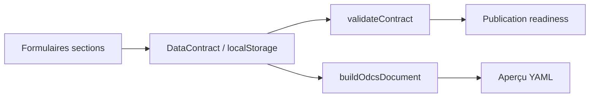

# Documentation fonctionnelle et technique — Data Contract Studio Prototype

Cette documentation décrit le comportement **observé dans le codebase actuel** du prototype. Elle ne constitue pas une spécification produit future ni une interprétation des intentions métier.

- **Source :** code applicatif du dépôt `zeenea-dcb` (lecture au moment de la rédaction).
- **Référence P1 :** fichier [`p1.md`](../p1.md) (54 lignes P1 ODCS v3.1.0).
- **Objectif :** documentation factuelle du prototype, utile aux PM, clients et développeurs.
- **Libellés produit :** le titre de ce document utilise **Data Contract Studio** ; le code et l’interface utilisent aussi le libellé **Data Contract Builder** (constante `APP_NAME` dans `src/lib/uxCopy.ts`, titre du dépôt dans `README.md`).

---

## Sommaire

1. [Vue d’ensemble du prototype](#1-vue-densemble-du-prototype)
2. [Publics utilisateurs et rôles](#2-publics-utilisateurs-et-rôles)
3. [Cycle de vie du contrat](#3-cycle-de-vie-du-contrat)
4. [Structure globale d’un contrat](#4-structure-globale-dun-contrat)
5. [Fundamentals](#5-fundamentals)
6. [Schema / Data model](#6-schema--data-model)
7. [Array items](#7-array-items)
8. [Relationships / foreign keys](#8-relationships--foreign-keys)
9. [Quality rules](#9-quality-rules)
10. [Authoritative definitions](#10-authoritative-definitions)
11. [Tags](#11-tags)
12. [Custom properties](#12-custom-properties)
13. [SLA](#13-sla)
14. [Roles / Data access](#14-roles--data-access)
15. [Publication readiness / validation](#15-publication-readiness--validation)
16. [YAML export](#16-yaml-export)
17. [Import DDL](#17-import-ddl)
18. [Persistance / migrations](#18-persistance--migrations)
19. [Tests et conformité P1](#19-tests-et-conformité-p1)
20. [Architecture technique du prototype](#20-architecture-technique-du-prototype)
21. [Limites connues du prototype](#21-limites-connues-du-prototype)
22. [Guide rapide pour les développeurs](#22-guide-rapide-pour-les-développeurs)
23. [Checklist de maintien de conformité P1](#23-checklist-de-maintien-de-conformité-p1)

---

## 1. Vue d’ensemble du prototype

### Objectif général

Le prototype est une **application web SPA** (Single Page Application) qui permet de **créer, éditer et publier des contrats de données** alignés sur l’[Open Data Contract Standard (ODCS) v3.1.0](https://bitol-io.github.io/open-data-contract-standard/v3.1.0/). Le parcours observé commence au backlog (**Create contract** → vue temporaire `create`), puis soit un brouillon **Start from scratch**, soit un import SQL `CREATE TABLE` → contrat `proposed`, édition du modèle interne, et production d’un **fichier YAML ODCS** affiché en temps réel.

### Rôle du Data Contract Studio / Data Contract Builder

| Aspect | Comportement observé |
|--------|----------------------|
| Édition guidée | Sections formulaire (Fundamentals, Schema, gouvernance, SLA, etc.) |
| Conformité P1 | Champs et validations alignés sur les 54 lignes de `p1.md` |
| Publication | Workflow **simulé** (pas de dépôt externe réel) avec verrouillage du contrat publié |
| Persistance | Navigateur uniquement (`localStorage`) |

### Lien avec ODCS v3.1.0

- Le modèle exporte `apiVersion: v3.1.0` et `kind: DataContract` (constantes dans `src/lib/p1Constants.ts`, utilisées par `src/lib/odcsYamlGenerator.ts`).
- Le champ interne `dataContractSpecification: '3.1.0'` sur `DataContract` reflète la même version dans le modèle applicatif (`src/types/odcs.ts`).

### Rôle du fichier `p1.md`

`p1.md` liste **54 propriétés P1** extraites d’une référence Excel ODCS v3.1.0 (onglets « Schema Reference » et « Shared Components »). Le code de tests `src/lib/__tests__/p1-compliance.test.ts` contient **une assertion par ligne P1** pour éviter la régression des champs modèle, validation et export YAML.

### Niveau de conformité P1

Le prototype couvre les **54 lignes P1** documentées dans `p1.md` via les tests, validateurs et l'export YAML ; l'exposition UI dépend du champ et est documentée dans les sections concernées :

- constantes et validateurs dans `src/lib/p1Constants.ts` et `src/lib/p1Validation.ts` ;
- validation publication dans `src/lib/contractValidation.ts` ;
- export YAML dans `src/lib/odcsYamlGenerator.ts` ;
- tests exhaustifs dans `src/lib/__tests__/p1-compliance.test.ts`.

Des champs ODCS **hors P1** ou **hors scope UI** ne sont pas exposés (voir section 21).

### Ce que le prototype permet de faire (observé)

| Capacité | Détail |
|----------|--------|
| Backlog | Liste ; **Create contract** ouvre la vue `create` (aucun contrat tant que l’utilisateur n’a pas choisi) ; puis scratch → `draft` ou import SQL → `proposed` (`ContractsBacklog`, `createContract.ts`, `App.tsx`) |
| Import SQL | Coller ou charger un DDL ; parse multi-tables (`ImportSection`, `ddlParser.ts`) |
| Édition P1 | Fundamentals, schema, contacts, data access, SLA, custom properties |
| YAML | Onglet YAML temps réel (`YamlView`, `generateODCSYaml`) |
| Readiness | Panneau score + guidance (`ReadinessPanel`, `publicationReadiness.ts`) |
| Versions | Historique commits simulés, comparaison, abandon brouillon (`VersionsView`) |
| Publication | Modale **Publish contract** simulée (`PushToGitModal` — libellés UI dans `uxCopy.ts`) |
| Partage | Collaborateurs mock (`ShareModal`) |
| Design system | Page composants UI (`ComponentsPage`) |

### Ce que le prototype ne permet pas de faire (observé)

| Limite | Source |
|--------|--------|
| Pas de backend API | `storage.ts`, commentaires README |
| Pas de dépôt externe / sync réelle | `PushToGitModal` (identifiant de version simulé), message UI : *External repository sync is not connected in this prototype.* |
| Pas d’authentification SSO | `currentUser.ts` stub |
| Sections ODCS non implémentées en UI | `SectionId` : `terms`, `servers`, `pricing`, `collaboration`, `tests` sans rendu dans `App.tsx` |
| Pas d’export YAML des stakeholders, owner, collaborateurs | `src/lib/uxCopy.ts` (`EXPORT_COVERAGE`) |
| Unicité `id` contrat | Vérifiée uniquement contre les contrats **locaux** (`localStorage`), pas un registry distant |

---

## 2. Publics utilisateurs et rôles

Le prototype distingue **trois couches** de « rôles » : collaborateurs application, rôles ODCS (data access), et stakeholders (contacts gouvernance).

### 2.1 Collaborateurs application (`CollaboratorRole`)

Définis dans `src/types/odcs.ts` : `owner` | `editor` | `viewer`.

| Rôle | Droits observés | Limites | Impact édition | Impact lifecycle / publish |
|------|-----------------|---------|--------------|---------------------------|
| **owner** | Édition ; publication ; gestion membres (`ShareModal` avec `canManageMembers`) ; Deprecate ; Retire ; Publish | Owner seul pour le champ « Contract owner » en édition (`FundamentalsSection`) | Édition si contrat non verrouillé | Publish, Deprecate, Retire |
| **editor** | Édition ; **Start drafting** ; **New version** | Pas de Publish ; pas de gestion membres ; pas Deprecate/Retire | Édition si non verrouillé | Pas Publish |
| **viewer** | Lecture seule | `isContractLocked(..., isViewer: true)` toujours vrai | Aucune modification | Aucune action lifecycle dans la toolbar |

**Comportement par défaut :** si `contract.collaborators` est vide ou absent, `getMyRole` dans `App.tsx` retourne `owner`.

**Utilisateur courant (simulé) :** `CURRENT_USER` dans `src/lib/currentUser.ts` (id, name, email codés en dur). Le rôle effectif dépend de la présence de l’email dans `collaborators`.

**Mock :** l’annuaire d’invitation dans `ShareModal` utilise un tableau fixe `DIRECTORY` (utilisateurs fictifs), pas une API entreprise.

### 2.2 Rôles ODCS — Data access (`OdcsAccessRole`)

| Champ | Description | Validation publication |
|-------|-------------|------------------------|
| `role` | Nom du rôle IAM | Requis si la ligne n’est pas vide |
| `access` | `read` ou `write` | Requis si la ligne n’est pas vide |
| `description` | Texte libre | Optionnel |

- Section UI : **Data access** (`AccessRolesSection`).
- Export YAML : tableau `roles[]` (sans identifiant interne `id` de l’application).

### 2.3 Stakeholders — Governance contacts

| Aspect | Détail |
|--------|--------|
| Modèle | `Stakeholder` : name, role, email, team, notes |
| UI | Section **Governance contacts** (`StakeholdersSection`) |
| Export ODCS YAML | **Non exporté** — mentionné dans l’intro de section (`STAKEHOLDERS_INTRO`) |
| Readiness | Recommandé si champs personal data sans contact assigné (warning `pii-stakeholders`) |

### 2.4 Synthèse des impacts lecture seule

| Condition | Lecture seule |
|-----------|---------------|
| `viewer` | Oui (toujours) |
| `proposed` | Oui (`isContractEditableStatus` false) |
| `active` sans `inRevision` | Oui |
| `deprecated`, `retired` | Oui |

---

## 3. Cycle de vie du contrat

### 3.1 Statuts disponibles

Le code expose **cinq** statuts ODCS P1 (`LIFECYCLE_STATUSES` dans `src/lib/p1Constants.ts`) :

`proposed` · `draft` · `active` · `deprecated` · `retired`

### 3.2 Transitions système

Définies dans `LIFECYCLE_TRANSITIONS` (`src/lib/contractLifecycle.ts`) :

```
proposed → draft → active → deprecated → retired
```

Les transitions hors graphe sont rejetées par `canTransitionStatus`.

Actions système (`applyLifecycleAction`) :

| Action | Effet sur le statut |
|--------|---------------------|
| `start_draft` | `proposed` → `draft` (sinon inchangé) |
| `publish` | → `active` (depuis `draft` ou via logique publish) |
| `deprecate` | `active` → `deprecated` |
| `retire` | `deprecated` → `retired` |

### 3.3 Tableau lifecycle

| Statut | Description (comportement observé) | Éditable | Actions UI disponibles | Statut suivant possible |
|--------|-----------------------------------|----------|------------------------|-------------------------|
| **proposed** | Après **import SQL** depuis la vue `create`, ou contrat **legacy** (localStorage) avant **Start drafting** — pas créé par le seul clic backlog | Non (sauf section Import SQL via `isImportSectionEditable`) | **Start drafting** (toolbar) ; **Start from scratch** sur Import pour legacy `proposed` vide | `draft` |
| **draft** | Brouillon éditable — **Start from scratch** ou après **Start drafting** | Oui | **Publish** / **Publish update** (owner, si validation OK) | `active` |
| **active** | Publié, verrouillé | Non | **New version** (owner, editor) ; **Deprecate** (owner) ; bannière active | `deprecated` ou révision locale |
| **active** + `inRevision: true` | Révision sur contrat publié | Oui | **Publish update** (owner) ; **Discard changes** (versions) | `active` (après publish) |
| **deprecated** | Plus recommandé | Non | **Retire contract** (owner) ; bannière warning | `retired` |
| **retired** | Retiré | Non | Aucune action lifecycle dans la toolbar | — |

### 3.4 Création de contrat (backlog)

Un seul bouton **Create contract** ouvre la vue `AppView = 'create'` : écran Import **sans** contrat en state/localStorage (pas de `ContractTopBar`, pas de badge lifecycle).

| Étape | Factory / handler | Statut | Persistance |
|-------|-------------------|--------|-------------|
| Clic backlog | `setCurrentView('create')` uniquement | — | Aucun contrat créé |
| **Start from scratch** (écran create) | `createContract('manual')` | `draft` | Ajout state + localStorage |
| Import SQL (écran create) | `createContractWithImportedSchema(tables)` | `proposed` + dataset | Ajout state + localStorage |
| **Start drafting** (contrat `proposed` existant) | `handleStartDraft` | `draft` | — |
| Legacy : **Start from scratch** sur contrat `proposed` vide | `applyStartFromScratch` | `draft` | Contrats anciens localStorage |

Le champ `creationSource` est **UI-only** (non exporté YAML). L’entrée nav **Import SQL** est visible tant que le contrat est nouveau (`dataset` vide, `gitHistory` vide) et `creationSource !== 'manual'`.

**Vue `create` vs éditeur :** la vue `create` n’affiche **pas** de bannière lifecycle (pas encore de contrat). Les bannières ci-dessous s’appliquent uniquement en **éditeur** (`AppView = 'editor'`) pour un contrat déjà persisté en statut `proposed`.

### 3.4.1 Bannières lifecycle (`proposed`)

Helper : `getProposedLifecycleBannerMessage` (`src/lib/createContract.ts`), constantes dans `src/lib/uxCopy.ts`. Affichage dans `App.tsx` (bannière sous la top bar, pas sur la vue `create`).

| Contexte (`creationSource`, `dataset`) | Message UI (anglais, observé) |
|----------------------------------------|-------------------------------|
| `import` + `dataset` vide | *Import a SQL schema or start from scratch. Other sections unlock after drafting starts.* |
| `import` + `dataset` non vide | *Review the imported schema, then start drafting to edit the full contract.* |
| Legacy (pas de `creationSource`, ou autre) | *Start drafting to edit this contract.* |

### 3.5 Start drafting

- Handler : `handleStartDraft` dans `App.tsx`.
- Condition : `contract.info.status === 'proposed'`.
- Effet : `status` passe à `draft` via `applyLifecycleAction(..., 'start_draft')`.
- UI : bouton dans `ContractTopBar` pour owner et editor — **masqué** sur la section Import initiale quand `creationSource === 'import'` (`shouldHideStartDraftingInTopBar`) ; **visible** après import SQL (navigation vers Fundamentals), hors section Import, ou pour les contrats legacy `proposed` sans `creationSource`. **Non affiché** pour les contrats en `draft`.

### 3.6 Publication

**Conditions cumulatives** (`App.tsx`, `validateContract`, `publicationReadiness.ts`) :

1. `validateContract` : aucune erreur (`canPublish` true).
2. `canPublishFromStatus` : statut `draft` **ou** (`active` et `inRevision`).
3. `myRole === 'owner'`.
4. `hasEditedSincePublish === true`.

**Effets à la publication** (`handleGitPush`) :

- `info.status` → `active` ;
- `info.version` → version choisie dans la modale ;
- nouvel entrée `gitHistory` avec `snapshot` ;
- entrées précédentes de `gitHistory` : `contractStatus` → `deprecated` ;
- `inRevision` → `false`.

**Première publication :** la version affichée dans Fundamentals est conservée (`isFirstPublish` dans `PushToGitModal`).

**Publications suivantes :** bump **minor** ou **major** uniquement dans l’UI (`BUMP_CONFIG` : `minor`, `major`). La fonction `bumpVersion` supporte aussi `patch` mais **aucune carte bump patch n’est exposée** dans la modale.

### 3.7 Dépréciation et retrait

| Action | Depuis | Confirm dialog | Handler |
|--------|--------|----------------|---------|
| Deprecate | `active` (pas en `inRevision`) | Oui | `handleDeprecateContract` |
| Retire | `deprecated` | Oui | `handleRetireContract` |

### 3.8 Verrouillage UI et `isContractLocked`

```text
isContractLocked(status, inRevision, isViewer) =
  isViewer OR NOT isContractEditableStatus(status, inRevision)
```

`isContractEditableStatus` (`contractLifecycle.ts`) :

- `proposed` → false
- `draft` → true
- `active` → true seulement si `inRevision`
- `deprecated`, `retired` → false

Les handlers d'édition du contenu ODCS (fundamentals, schema, stakeholders, roles, SLA, custom properties) vérifient `isContractLocked`. La gestion des collaborateurs via `handleCollaboratorsChange` ne passe pas par ce garde-fou.

**Exception Import SQL** : `isImportSectionEditable(status, isViewer)` retourne `true` en statut `proposed` (parcours import). `ImportSection` et `handleDDLParsed` utilisent cette règle pour permettre le paste/upload DDL avant **Start drafting**.

### 3.9 Validations lifecycle associées

| Code | Message (publication) |
|------|------------------------|
| `status-proposed` | Start drafting before publishing. |
| (blocage statut) | Contract must be in draft (or in revision) before publishing. |

---

## 4. Structure globale d’un contrat

### 4.1 Modèle `DataContract` (`src/types/odcs.ts`)

| Famille | Champs principaux | Section UI | Export YAML ODCS |
|---------|-------------------|------------|------------------|
| Identité | `id`, `info`, `dataContractSpecification` | Fundamentals | Oui (sauf owner) |
| Schéma | `dataset[]` | Schema | `schema[]` |
| SLA | `slaProperties[]` | Service levels | `slaProperties[]` |
| Data access | `roles[]` | Data access | `roles[]` |
| Custom | `customProperties[]` | Custom | `customProperties[]` |
| Gouvernance app | `stakeholders[]` | Governance contacts | **Non** |
| Collaboration app | `collaborators[]` | Share modal | **Non** |
| Workflow app | `gitHistory[]`, `openPR`, `inRevision`, `uid`, timestamps | Versions / toolbar | **Non** |

Texte produit explicite dans `EXPORT_COVERAGE` (`src/lib/uxCopy.ts`) :

- **Exported contract file :** identity, description, schema, tags, quality rules, reference links, data access roles, service levels.
- **Managed in the app only :** contract owner, governance contacts, collaborators, version history.

**Densité UI (headers / pills) :** les *concept tags* abstraits (Accountability, Application access, etc.) ne sont plus affichés dans les en-têtes de section ni dans la modale Collaborators. Le périmètre export / app-only est porté par les **descriptions** de section, les **helpers** de champ (ex. contract owner) et la vue **YAML** (`EXPORT_COVERAGE`). Les pills `WorkflowMetadataPill` (« App only », « Not in exported contract ») restent disponibles mais sont utilisées avec parcimonie — au plus un signal par section ou modale, sans doublon pill + texte identique. Le statut de cycle de vie n’est affiché que dans la barre supérieure (pas dans Fundamentals).

**Content system (intros & guidance) :**

| Priorité | Où | Rôle |
|----------|-----|------|
| Export scope (détail) | Vue YAML (`EXPORT_COVERAGE`) | Référence complète export vs app |
| Publication | `ReadinessPanel` | Score, blocage publish, **Details to fix**, checklist |
| Section | Intro `ContractSectionHeader` (≤ 2 phrases, ~160 car.) | Utilité immédiate, sans jargon ODCS |
| Champ | Helpers conditionnels (`GuidanceField`, ex. contract owner) | Export / app-only au plus près du champ |

Intros de section raccourcies (Fundamentals, Data access, Governance contacts, Versions, Custom, SLA) : pas de répétition des messages export déjà dans YAML ou helpers.

### 4.2 Navigation éditeur

Sections rendues dans `ContractSectionNav` :

1. Import SQL *(contrat nouveau : `dataset` vide et `gitHistory` vide — masqué si `creationSource === 'manual'`)*
2. Fundamentals
3. Schema
4. Governance contacts (`stakeholders`)
5. Data access (`accessRoles`)
6. Service levels (`sla`)
7. Custom (`custom`)
8. Versions (`versions`)

`SectionId` déclarés dans les types mais **sans section UI** dans `App.tsx` : `terms`, `servers`, `pricing`, `collaboration`, `tests`. L’alias `team` dans `App.tsx` affiche la même section que `stakeholders`.

### 4.3 Onglets

| Onglet | Composant |
|--------|-----------|
| Form | Sections formulaire |
| YAML | `YamlView` |

### 4.4 Readiness

- Affiché si : contrat ouvert, onglet Form, section ≠ `import` et ≠ `versions`.
- Layout : panneau épinglé (breakpoint `panelPinned`) ou overlay avec bouton toggle.

**Hiérarchie visuelle du panneau** (`ReadinessPanel`, libellés `uxCopy.ts`) :

1. **Details to fix** — erreurs de validation après tentative de publish (prioritaire) ; libellés via `validationUserMessage` (`validationUserMessages.ts`).
2. **Required before publishing** — checklist bloquante ; en-tête de section `{earned} / 70` (poids `READINESS_REQUIRED_WEIGHT`).
3. **Field quality** — en-tête `{earned} / 25` ; sous-ligne **Documented fields** : `{n} / {total} described` ; si incomplet, `{n} undocumented` (ou lien « without description » si navigation active).
4. **Recommendations** — avertissements non bloquants (style secondaire), messages user-friendly.
5. **Suggested improvements** — en-tête `{earned} / 5` ; checklist : Domain, Business purpose, Governance contacts, Data access, Reference links (cinq axes distincts ; les descriptions de champs relèvent uniquement de **Field quality** `/25`).
6. **Next steps** — rappels courts si présents.

**Scores affichés (brouillon, non publié) :**

| Zone | Affichage observé |
|------|-------------------|
| En-tête panneau (`READINESS_PANEL_TITLE`) | `{healthScore} / 100` |
| Required before publishing | `{earned} / 70` |
| Field quality | `{earned} / 25` + barre documentée |
| Suggested improvements | `{earned} / 5` |

En-tête : barre de progression discrète, message publish. Contrat publié : titre **Contract quality**, pas de fraction `/100` en en-tête. Wording utilisateur : « personal data » (pas d’acronyme PII visible dans le panneau).

### 4.5 Lien UI → modèle → YAML



---

## 5. Fundamentals

Mapping Fundamentals → export YAML via `buildOdcsDocument` (`odcsYamlGenerator.ts`). Le champ `info.title` devient `name` dans le YAML.

| Champ ODCS / interne | Source UI / système | Éditable | Génération / règle | Validation (publication) | Export YAML | Remarque P1 |
|---------------------|---------------------|----------|-------------------|--------------------------|-------------|-------------|
| `apiVersion` | Système | Non | `v3.1.0` (`ODCS_API_VERSION`) | — | Oui | P1 required |
| `kind` | Système | Non | `DataContract` (`ODCS_KIND`) | — | Oui | P1 required |
| `id` | Dérivé du nom | Non (affiché, copiable) | `deriveContractId(title, uid)` à chaque changement de titre | Format hybride `{slug-du-nom}-{suffixe-8-hex}` : lowercase ASCII, tirets uniquement ; suffixe déterministe depuis `uid` (ou le nom à la création) ; unicité registry ; non éditable | Oui | P1 required |
| `version` | Système / publish | Non en UI | Bump minor/major à la publish (sauf 1ère publish) | SemVer `x.y.z` | Oui | P1 required |
| `status` | Système lifecycle | Non | Actions lifecycle | Valeur valide ; pas `proposed` à la publish | Oui | P1 required |
| `name` | Contract name (`info.title`) | Oui | — | Requis | Oui | P1 |
| `domain` | Input | Oui | — | Recommandé readiness | Oui si non vide | P1 |
| `description.purpose` | Business purpose | Oui | `info.description` | Recommandé | Oui | P1 |
| `description.usage` | Additional context | Oui | `info.descriptionUsage` | — | Oui | P1 |
| `description.limitations` | Additional context | Oui | `info.descriptionLimitations` | — | Oui | P1 |
| `description.authoritativeDefinitions` | Reference links | Oui | Types fundamentals uniquement | URL + type requis si ligne non vide ; type ∈ {privacyStatement, termsAndConditions, licenseAgreement} | Oui | P1 |
| `tags` | TagsEditor | Oui | trim uniquement | — | Oui | P1 |
| `owner` | Contract owner | Owner uniquement | — | Requis à la publish | **Non exporté** | Non P1 ; workflow-only |

Types fundamentals autorisés : `FUNDAMENTALS_AUTH_DEF_TYPES` dans `p1Constants.ts`.

---

## 6. Schema / Data model

Le schéma interne est `dataset: SchemaTable[]`. L’export YAML utilise la clé `schema[]` (ODCS).

### 6.1 Table (`SchemaTable`)

| Champ interne | Libellé UI (observé) | Éditable | Export YAML | Notes |
|---------------|---------------------|----------|-------------|-------|
| `id` | Système / avancé | Partiel | Oui | `stableSchemaId(physicalName)` ; préfixe `tbl-` après migration |
| `physicalName` | Nom technique table | Oui | Oui | |
| `quantumName` | Entity name | Oui | **Non** | Dérivé DDL : titre case depuis `physicalName` |
| `tableType` | `table` \| `view` | Oui | **Non** | Toujours `table` à l’import DDL |
| `description` | Description | Oui | Oui | |
| `tags` | Oui | Oui | |
| `quality` | Table properties dialog | Oui | Oui | AI verify requis à la publish (table-level) |
| `authoritativeDefinitions` | Reference links Zeenea | Oui | Oui | type `actian` |
| `relationships` | Table relationships | Oui | Partiel | Voir section 8 |

### 6.2 Colonne (`ColumnDefinition`)

| Champ interne | Libellé UI | Export YAML | Notes |
|---------------|------------|-------------|-------|
| `id` | Stable | Oui | `stablePropertyId(schemaId, physicalName)` |
| `physicalName` | Technical format | Oui | |
| `logicalName` | Business label | **Non** | Dérivé à l’import DDL |
| `physicalType` | Oui | Oui | Uppercase à l’import |
| `logicalType` | Type picker | Oui | `string`, `integer`, `number`, `boolean`, `timestamp`, `date`, `object`, `array`, `unknown` |
| `required` | Nullability | Oui | `NOT NULL` ou PK → required |
| `isPrimaryKey` | PK flag | via `primaryKeyPosition` | |
| `primaryKeyPosition` | Calculé export | Oui | `1..n` si PK ; `-1` sinon (`NOT_PRIMARY_KEY_POSITION`) |
| `description` | Oui | Oui | |
| `examples` | Oui | Oui | Tableau de strings |
| `tags` | Oui | Oui | |
| `quality` / `qualityRule` | Column advanced | Oui | Legacy `qualityRule` migré vers `quality[]` |
| `authoritativeDefinitions` | Zeenea | Oui | |
| `foreignKey` | Foreign key editor | `relationships` sur property | |
| `items` | Array items editor | Oui si `logicalType === array` | Voir section 7 |
| `isPII` | Flag UI | **Non** | Warning si PII sans stakeholders |
| `isUnique` | Flag UI | **Non** | Parsé depuis DDL `UNIQUE` |
| `isUnknownType` | Indicateur | **Non** | `true` si type SQL non mappé |

### 6.3 Validations schema (publication)

| Règle | Sévérité |
|-------|----------|
| Au moins une table | error |
| Chaque table ≥ 1 colonne | error |
| Doublons `physicalName` (case-insensitive) par table | error |
| Doublons `schema[].id` / `properties[].id` | error |
| Positions PK consécutives uniques | error |
| FK colonne partielle | error |
| Array sans `items` valides | error |
| Quality / auth defs Zeenea | error si règles déclenchées |

---

## 7. Array items

### Disponibilité

Le champ `items` est présent lorsque `logicalType === 'array'` (`arrayPropertyNeedsItems` dans `p1Validation.ts`).

### Comportement UI

`PropertyItemsEditor` (`src/components/schema/PropertyItemsEditor.tsx`) :

| `items.logicalType` | Comportement |
|-------------------|--------------|
| `string` | Sélection type élément string |
| `object` | Saisie noms nested séparés par virgules → génération propriétés minimales (`id: item_{name}`, `physicalType: VARCHAR`, etc.) |

### Export YAML

`mapPropertyItemsToYaml` : exporte `logicalType` et, pour `object`, un tableau `properties` réduit (id, physicalName, physicalType, logicalType).

### Limites prototype

- Pas d’éditeur complet de colonnes nested pour `object` items (saisie CSV uniquement).
- Validation publication : `object` requiert `properties.length > 0`.

---

## 8. Relationships / foreign keys

### Configuration UI

| Mécanisme | Composant / emplacement |
|-----------|-------------------------|
| FK simple | `ColumnForeignKeyEditor` sur la colonne (`foreignKey.toTable`, `foreignKey.toColumn`) |
| Relations table | `TableRelationshipRow` — types : `has_one`, `has_many`, `belongs_to`, `many_to_many`, `composite_foreign_key` |

### Format interne

- Colonne : `ColumnForeignKey { toTable, toColumn }`
- Table : `TableRelationship` avec `fromColumn`/`toColumn` (legacy belongs_to) ou `fromColumns`/`toColumns` (composite)

### Format YAML exporté (`relationshipExport.ts`)

| Cas | Niveau | Format observé |
|-----|--------|----------------|
| FK simple complète | Property `relationships[]` | `{ type: 'foreignKey', to: '/schema/{tableId}/properties/{propertyId}' }` — champ **`from` implicite** au niveau property |
| Legacy `belongs_to` complet (1 colonne) | Property (à l'export YAML) | Même format `foreignKey` |
| Composite FK (≥ 2 paires colonnes) | `schema[].relationships[]` | `{ type: 'foreignKey', from: [...pointers], to: [...pointers] }` |
| `many_to_many` | `schema[].relationships[]` | `{ type: 'manyToMany', from: [...], to: [...] }` |

Pointeurs : `propertyRelationshipPointer` construit `/schema/{schemaId}/properties/{propertyId}`.

### Types non exportés / incomplets

| Type / état | Comportement |
|-------------|--------------|
| `has_one`, `has_many` | Warning `relationship-not-exported` ; badge « Not published » en UI |
| `belongs_to` incomplet | Warning `relationship-incomplete-fk` |
| Composite incomplet | Warning `composite-fk-incomplete` |
| FK colonne partielle | **Error** bloquant publish |

### Limites connues

- Les tables référencées doivent exister dans le même contrat pour résoudre les pointeurs ; sinon le pointer peut être vide et l’entrée omise à l’export.
- `many_to_many` : validation composite considère ce type comme non incomplet (`isCompositeRelationshipIncomplete` retourne false pour `many_to_many`).

---

## 9. Quality rules

### Modèle (`QualityRule` dans `odcs.ts`)

| Champ | Valeur / règle |
|-------|----------------|
| `type` | Forcé à `'text'` (UI, modèle, export) |
| `id` | Stable ; généré si absent (`ensureQualityRuleIds`) |
| `name` | Optionnel |
| `description` | Requis si règle non vide |
| `dimension` | Optionnel ; requis si contenu présent (`qualityRuleNeedsDimension`) |
| `severity`, `businessImpact` | Optionnels (texte libre) |
| `aiVerified` | Booléen interne ; **non exporté** en YAML |

### Table-level vs column-level

| Niveau | UI AI verification | Validation publication |
|--------|-------------------|------------------------|
| Table (`table.quality`) | Bouton **Verify with AI (mock)** (`TableAdvancedDialog`, `showAiVerification`) | `requireAiVerified: true` — bloque publish si `aiVerified` false |
| Colonne (`col.quality`) | Pas de bouton AI | `requireAiVerified: false` |

### Mock AI

Le bouton « Verify with AI (mock) » dans `QualityRulesEditor.tsx` définit `aiVerified: true` localement. **Aucun appel service externe.**

### Autres limites

- Maximum **3** règles par éditeur (`MAX_RULES` dans `QualityRulesEditor.tsx`).
- Dimensions autorisées : `QUALITY_DIMENSIONS` dans `p1Constants.ts` (7 valeurs P1).

---

## 10. Authoritative definitions

### Variantes

| Contexte | Variant UI | Types autorisés | Validation |
|----------|------------|-----------------|------------|
| Fundamentals — description | `fundamentals` | `privacyStatement`, `termsAndConditions`, `licenseAgreement` | `isValidFundamentalsAuthDefType` |
| Table / colonne schema | `zeenea` | `actian` uniquement (`ZEENEA_AUTH_DEF_TYPE`) | URL dans catalogue mock **ou** regex `ZEENEA_ACTIAN_URL_PATTERN` |
| Shared générique (ODCS) | `shared` (défaut du composant réutilisable) | `SHARED_AUTH_DEF_TYPES` dans `p1Constants.ts` (`businessDefinition`, `transformationImplementation`, `videoTutorial`, `tutorial`, `implementation`) | **Non routé dans l’UI actuelle** — constantes de référence ODCS alignées sur `p1.md` ; le prototype P1 utilise uniquement `fundamentals` (3 types) et `zeenea` (`actian`) selon le contexte. Ce n’est pas un défaut utilisateur : aucun écran n’instancie `variant="shared"` tant que le périmètre produit ne l’exige pas. |

### Catalogue mock Zeenea

`src/lib/zeeneaCatalog.ts` — **4 entrées** fixes (`ZEENEA_CATALOG`), URLs sous `https://catalog.zeenea.example/actian/...`.

Pattern URL alternatif accepté (`p1Constants.ts`) :

```text
^https://catalog\.zeenea\.example/actian/[a-z0-9/_-]+$
```

### Export YAML

Champs exportés : `url`, `type`, `description` (optionnel). Lignes incomplètes ou vides sont filtrées (`mapAuthoritativeDefinitionsToYaml`).

---

## 11. Tags

| Règle | Détail |
|-------|--------|
| Saisie | Libre (`TagsEditor`) |
| Normalisation | `trim` uniquement ; **casse conservée** (`normalizeTags` dans `odcsSharedMappers.ts`) |
| Niveaux | Contrat (`info.tags`), table (`table.tags`), colonne (`col.tags`) |

Non documenté dans le prototype actuel : validation de format ou liste fermée de tags.

---

## 12. Custom properties

| Champ | Règle |
|-------|-------|
| `property` | camelCase — regex `CUSTOM_PROPERTY_REGEX` (`^[a-z][a-zA-Z0-9]*$`) |
| `value` | Requis si ligne non vide |
| `description` | Optionnel |

- UI : `CustomPropertiesSection` / `CustomPropertiesEditor`.
- Lignes entièrement vides ignorées pour validation et export.
- Export YAML : `property`, `value`, `description?` (sans `id` interne application).

---

## 13. SLA

Modèle `SlaProperty` ; section **Service levels** (`SlaSection`).

| Champ | Required (si ligne non vide) | Valeurs / format |
|-------|------------------------------|------------------|
| `value` | **Oui** (seul champ P1 required SLA) | Texte libre |
| `unit` | Non | `SLA_UNITS` : d, day, days, y, yr, years, h, hr, hours |
| `element` | Non | `Object.Property` ; multiples séparés par virgule |
| `driver` | Non | `regulatory`, `analytics`, `operational` |
| `description` | Non | Texte libre |

**Champ legacy `property` :** absent du modèle actuel ; migration `migrateSlaRow` dans `storage.ts` ne le conserve pas. Les tests vérifient `sla[0].property === undefined` à l’export.

---

## 14. Roles / Data access

Voir section 2.2. Export YAML exemple (fixture P1) :

```yaml
roles:
  - role: microstrategy_user_opr
    access: read
    description: Read-only access
```

---

## 15. Publication readiness / validation

### Panneau Readiness

Copie orientée action dans `src/lib/uxCopy.ts` (`READINESS_*`, helpers de champ). Le panneau reste la **source centrale** pour savoir si l’on peut publier ; les intros de section ne dupliquent pas cette logique.

`computePublicationReadiness` (`publicationReadiness.ts`) combine :

| Composante | Poids |
|------------|-------|
| Champs requis (guidance) | 70 |
| Documentation champs (descriptions) | 25 |
| Recommandations | 5 |

Guidance requise (`buildReadinessGuidanceItems`) : contract name, id, owner, version, schema fields.

Recommandé : domain, purpose, governance contacts, data access, reference links. Les descriptions de champs ne figurent pas ici (uniquement **Field quality**, poids 25).

### Règles de blocage (erreurs `validateContract`)

Liste des codes erreur observés dans `contractValidation.ts` :

`title`, `id`, `id-format`, `id-derived`, `id-duplicate`, `owner`, `version`, `status-invalid`, `status-proposed`, `auth-def-incomplete`, `auth-def-fundamentals-type`, `schema-id-duplicate`, `property-id-duplicate`, `custom-incomplete`, `custom-property-format`, `schema`, `schema-empty-table`, `duplicate-column`, `pk-positions`, `quality-empty`, `quality-dimension`, `quality-dimension-invalid`, `quality-ai-unverified`, `auth-def-zeenea`, `column-fk-incomplete`, `array-items`, `sla-value-required`, `sla-unit-invalid`, `sla-driver-invalid`, `sla-element-invalid`, `role-incomplete`, `role-access`.

### Avertissements (non bloquants)

`relationship-not-exported`, `relationship-incomplete-fk`, `composite-fk-incomplete`, `pii-stakeholders`.

### Différence validation UI vs publication

| Aspect | Comportement |
|--------|--------------|
| Publication | `validateContract` exécuté pour readiness et publish |
| Saisie continue | Pas de validation exhaustive champ par champ sur chaque frappe ; certains champs (usage, limitations) utilisent debounce 300 ms |
| Quality AI | Contrôle UI sur table ; blocage uniquement à la publish |
| Owner | Éditable seulement par owner ; erreur owner à la publish pour tous |

Message publish si non-owner : `PUBLISH_REQUIRES_PUBLISHER` / `PUBLISH_REQUIRES_PUBLISHER_CONTRACT` (`uxCopy.ts`).

**Messages validation user-friendly** (`src/lib/validationUserMessages.ts`) : couche UI qui mappe les `ValidationIssue` techniques (codes `contractValidation.ts`) vers des libellés lisibles. Utilisée dans **ReadinessPanel** (Details to fix, Recommendations), **PushToGitModal** (avertissements), et `publishBlockUserMessage` pour le statut publish (`publicationReadiness.ts`, `App.tsx`). Si aucun mapping dédié n’existe pour un code, le message technique est conservé.

---

## 16. YAML export

### Générateur

- `buildOdcsDocument(contract)` → objet JS
- `generateODCSYaml(contract)` → chaîne YAML via `js-yaml` (`indent: 2`, `lineWidth: 120`)

Fichier : `src/lib/odcsYamlGenerator.ts`.

### Champs hardcodés / système

| Champ | Valeur |
|-------|--------|
| `apiVersion` | `v3.1.0` |
| `kind` | `DataContract` |

### Champs P1 exportés (racine)

Vérifiés par test golden dans `p1-compliance.test.ts` :

`apiVersion`, `kind`, `id`, `version`, `status`, `name`, `domain`, `description`, `tags`, `schema`, `slaProperties`, `roles`, `customProperties`.

### Champs explicitement non exportés (observés)

| Élément | Raison |
|---------|--------|
| `dataProduct` | Absent — test `expect(doc.dataProduct).toBeUndefined()` |
| `stakeholders` | Non exporté — texte dans l’intro Governance contacts |
| `collaborators` | Non exporté — texte dans la modale Collaborators |
| `owner` | Non exporté — helper sous Contract owner (Fundamentals) |
| `gitHistory`, `openPR`, `inRevision`, `uid` | Application |
| `logicalName`, `quantumName`, `isPII`, `isUnique`, `tableType` | Modèle UI interne |
| `aiVerified` sur quality | Non mappé dans `mapQualityRulesToYaml` |
| `slaProperties[].property` | Legacy retiré |

### Exemple YAML court (fixture P1 — extrait validé par tests)

Source : `buildP1FixtureContract()` dans `src/lib/__tests__/p1-fixture.ts`, validé par `src/lib/__tests__/odcsYamlGenerator.test.ts`. Extrait représentatif (structure réelle produite par le générateur) :

```yaml
kind: DataContract
apiVersion: v3.1.0
id: seller-payments-v1-6987f902
version: 1.1.0
status: draft
name: Seller Payments v1
domain: seller
description:
  purpose: Views built on top of seller tables.
  usage: Twice a day.
  limitations: Cannot be used in conjunction with full moon days.
  authoritativeDefinitions:
    - url: https://example.com/privacy
      type: privacyStatement
      description: Privacy
tags:
  - finance
  - sensitive
customProperties:
  - property: dataSteward
    value: john.doe@example.com
    description: Owner responsible for data quality.
schema:
  - id: tbl-orders
    physicalName: orders
    description: Provides core payment metrics
    properties:
      - id: tbl_orders_txn_ref_dt_prop
        physicalName: TXN_REF_DT
        physicalType: DATE
        logicalType: date
        required: true
        primaryKeyPosition: 1
        relationships:
          - type: foreignKey
            to: /schema/tbl-customers/properties/tbl_customers_id_prop
slaProperties:
  - value: "4"
    unit: h
    element: orders.TXN_REF_DT
    driver: regulatory
roles:
  - role: microstrategy_user_opr
    access: read
```

### Relationship pointers

Exemple testé : `to: /schema/tbl-customers/properties/tbl_customers_id_prop` pour une FK depuis `tbl-orders` (`odcsYamlGenerator.test.ts`).

### `primaryKeyPosition: -1`

Les colonnes non-PK reçoivent `NOT_PRIMARY_KEY_POSITION` (-1) à l’export (`resolvePrimaryKeyPosition`).

---

## 17. Import DDL

Implémentation : `src/lib/ddlParser.ts`, UI : `src/components/sections/ImportSection.tsx`.

### Entrée acceptée

| Fonctionnalité | Détail |
|----------------|--------|
| Instructions | `CREATE TABLE` (regex globale, flag `gi`) |
| Variantes | `CREATE OR REPLACE TABLE`, `IF NOT EXISTS` |
| Identifiants table | Backticks, guillemets doubles, crochets, ou identifiant simple ; schéma qualifié (`db.table` → nom table = dernier segment) |
| Multi-tables | `parseDDLMulti` — toutes les tables du script |
| Nettoyage | Commentaires `--` et `/* */` retirés (`cleanDDL`) |
| Fichier démo | Import possible depuis `demo.sql` (chargé via Vite `?raw` dans `ImportSection`) |

### Ce que le parser extrait

| Élément SQL | Mapping interne |
|-------------|-----------------|
| Nom table | `physicalName`, `quantumName` (titre depuis underscores) |
| Colonnes (lignes définition) | `ColumnDefinition` avec types, flags |
| `NOT NULL` / `PRIMARY KEY` inline | `required`, `isPrimaryKey` |
| `UNIQUE` inline | `isUnique` |
| `REFERENCES` inline (1 colonne) | `foreignKey` sur la colonne |
| `FOREIGN KEY (...) REFERENCES (...)` table-level | 1→1 : `foreignKey` colonne ; ≥2 paires : `relationships[]` type `composite_foreign_key` |
| Types SQL connus | `SQL_TYPE_MAP` → `logicalType` + libellé UI |
| Type inconnu | `logicalType: 'string'`, `isUnknownType: true` |

### Ce que le parser ignore

Lignes de contraintes table traitées par `isTableConstraintLine` sans créer de colonnes :

- `PRIMARY KEY (...)` table-level
- `FOREIGN KEY` déjà traité séparément si pattern reconnu
- `CONSTRAINT` (autres)
- `UNIQUE`, `CHECK`, `INDEX`, `KEY` table-level

### IDs stables après import

`buildTable` applique :

- `stableSchemaId(tableName)` → `id` table (ex. `tbl-orders`)
- `stablePropertyId(schemaId, physicalName)` → `id` colonne

À l’import initial, `parseColumnLine` utilise `generateId()` temporaire puis remplace dans `buildTable`.

### Champs P1 non inférés depuis DDL

Le parser initialise notamment à vide / défaut : `description`, `tags`, `quality`, `authoritativeDefinitions`, `examples`, `items` (sauf si type logique array choisi manuellement après coup), SLA, roles, custom properties, fundamentals (sauf titre suggéré si vide).

`App.tsx` après import : peut préremplir `info.title` (première table ou nom unique) et `id` via `deriveContractId(title, uid)`.

### UI import

- Animation de progression **simulée** (timeouts 1,4 s / 2,7 s / 5,2 s) — pas liée au temps réel du parseur.
- Preview : `summarizeDDLImport(parseDDLMulti(ddl))` avant validation.
- **Verrouillage :** en éditeur, `isLocked` bloque l’import pour la plupart des statuts verrouillés ; en statut **`proposed`**, la section Import reste **éditable** via `isImportSectionEditable` (même si `isContractLocked` est vrai pour le reste du contrat). Sur la vue **`create`**, `ImportSection` reçoit `isLocked={false}` (pas encore de contrat).

### Limites connues

| Limite | Détail |
|--------|--------|
| Dialectes | Sous-ensemble SQL documenté par le code ; pas de preuve de support exhaustif PostgreSQL/MySQL/Oracle |
| `CREATE VIEW` | Non documenté dans le prototype actuel |
| FK vers table absente du même script | `foreignKey` créée mais pointeur YAML peut échouer à l’export |
| Patch bump version | Non applicable à l’import |

---

## 18. Persistance / migrations

### Stockage

| Paramètre | Valeur |
|-----------|--------|
| Clé | `data-contracts-v1` |
| API | `loadContracts` / `saveContracts` (`src/lib/storage.ts`) |
| Format | JSON sérialisé `DataContract[]` |
| Seed | `SEED_CONTRACTS` si clé absente ou parse error |

### Migrations à chaque chargement (`migrateContract`)

| Migration | Détail |
|-----------|--------|
| Lifecycle status | Normalisation vers les 5 statuts P1 |
| Contract `id` | Migration des ids slug-only legacy vers `{slug}-{suffixe-8-hex}` via `deriveContractId(title, uid)` |
| SLA | Suppression champ legacy `property` ; garantie `id` |
| Custom properties | Garantie `id` |
| Schema / property ids | `stableSchemaId` / `stablePropertyId` si id absent ou non conforme |
| Tags | `normalizeTags` |
| Quality | ids, `type: text`, `aiVerified` default false ; migration `qualityRule` → `quality[]` |
| Authoritative defs | Garantie `id` |
| Stakeholders | Garantie `id`, champs par défaut |
| Git commits | `migrateGitCommit` ; statuts lifecycle sur historique |

### Sauvegarde

`saveContracts` : en cas d’erreur (ex. quota dépassé), **échec silencieux** (catch vide).

### Risques

- Contrats anciens dans `localStorage` sont re-migrés à chaque load ; pas de versioning de schéma de stockage explicite.
- Unicité `id` contrat : portée locale uniquement.

---

## 19. Tests et conformité P1

### Framework

**Vitest** v4 — scripts `npm test` (run) et `npm run test:watch` (`package.json`).

### Fichiers de tests (`src/lib/__tests__/`)

| Fichier | Rôle | Cas `it(` / `test(` |
|---------|------|----------------------|
| `p1-compliance.test.ts` | 54 lignes P1 + tests transverses (dont assertions dynamiques par ligne `p1.md`) | 7 fichiers `describe` + boucles |
| `createContract.test.ts` | Factories création, `getProposedLifecycleBannerMessage`, `shouldHideStartDraftingInTopBar`, `applyStartFromScratch` | 15 |
| `contractLifecycle.test.ts` | Transitions, lock, `isImportSectionEditable`, publish status | 8 |
| `contractValidation.test.ts` | Validation publish, SLA, AI, proposed | 10 |
| `validationUserMessages.test.ts` | Mapping messages UI depuis `ValidationIssue` | 8 |
| `odcsYamlGenerator.test.ts` | Structure export fixture P1 | 10 |
| `p1Validation.test.ts` | Helpers unitaires P1 | 11 |
| `idDerivation.test.ts` | IDs hybrides contrat / schema / property | 10 |
| `p1-fixture.ts` | Données fixture (pas un test) | — |

**Total observé :** **157** tests (`npm test`, Vitest) — dont couverture lifecycle/import/bannières `proposed` dans `createContract.test.ts` et `contractLifecycle.test.ts`.

### Rôle de `p1-compliance.test.ts`

- Une assertion nommée par ligne de `p1.md` (54).
- Test golden des clés racine YAML.
- Validation fixture complète sans erreur.
- Rejet URLs Zeenea hors catalogue/pattern.
- Détection doublon `id` registry local.
- Blocage publish en statut `proposed`.

### Limites des tests

- Pas de tests composants React observés dans `src/lib/__tests__/`.
- Pas de tests e2e navigateur documentés.
- Registry = tableau de contrats passé à `validateContract`, pas serveur distant.

---

## 20. Architecture technique du prototype

### Stack observable

| Couche | Technologie |
|--------|-------------|
| UI | React 19 |
| Langage | TypeScript 6 (strict) |
| Build | Vite 8 |
| Styles | Tailwind CSS 4 |
| Composants | Base UI (`@base-ui/react`) + composants maison `src/components/ui/` |
| YAML | js-yaml |
| Icônes | lucide-react |
| Tests | Vitest |
| Persistance | localStorage |

### Vues applicatives (`AppView`)

| Vue | Composant / comportement |
|-----|--------------------------|
| `backlog` | `ContractsBacklog` |
| `create` | Écran temporaire **Create contract** : `ImportSection` seul, breadcrumb `Contracts > Create contract` (`AppTopBar`) ; pas de `ContractTopBar`, badge lifecycle, YAML ni collaborateurs ; **aucune persistance** tant que l’utilisateur n’a pas choisi Start from scratch ou import SQL |
| `editor` | Éditeur contrat (sections, readiness, publication) |
| `components` | `ComponentsPage` |

### Tableau fichiers / dossiers clés

| Fichier / dossier | Rôle |
|-------------------|------|
| `src/App.tsx` | État global, handlers lifecycle, routing vues |
| `src/main.tsx` | Point d’entrée React |
| `src/types/odcs.ts` | Modèle métier principal |
| `src/types/odcsShared.ts` | Types partagés, types export relationships |
| `src/lib/p1Constants.ts` | Constantes ODCS P1 |
| `src/lib/p1Validation.ts` | Validateurs atomiques P1 |
| `src/lib/contractValidation.ts` | Validation publication |
| `src/lib/contractLifecycle.ts` | Statuts et transitions |
| `src/lib/odcsYamlGenerator.ts` | Export YAML ODCS |
| `src/lib/odcsSharedMappers.ts` | Mappers YAML partagés (quality, tags, auth defs) |
| `src/lib/relationshipExport.ts` | Export FK / relationships |
| `src/lib/ddlParser.ts` | Import SQL → schema |
| `src/lib/storage.ts` | Persistance + migrations |
| `src/lib/idDerivation.ts` | Slugs contract / schema / property |
| `src/lib/publicationReadiness.ts` | Score readiness |
| `src/lib/readinessGuidance.ts` | Guidance par section |
| `src/lib/zeeneaCatalog.ts` | Catalogue Zeenea mock |
| `src/lib/seedContracts.ts` | Données démo initiales |
| `src/lib/currentUser.ts` | Utilisateur stub |
| `src/lib/uxCopy.ts` | Libellés UI et messages |
| `src/components/sections/` | Sections éditeur |
| `src/components/schema/` | Tables, colonnes, FK, items |
| `src/components/shared/` | Éditeurs réutilisables (tags, quality, auth defs, SLA) |
| `src/lib/__tests__/` | Tests unitaires P1 et métier |
| `p1.md` | Référence 54 lignes P1 |
| `design.md` | Spécification design (référence produit, pas source de vérité code) |

### Séparation des responsabilités

```text
types (odcs.ts)  →  état contrat
p1Constants      →  enums / regex P1
p1Validation     →  règles atomiques
contractValidation → orchestration erreurs publish
odcsYamlGenerator  → sortie ODCS
components/*       → UI
App.tsx            → orchestration + persistance
```

---

## 21. Limites connues du prototype

Liste issue du code et des tests (pas d’hypothèses produit future).

| Catégorie | Limite |
|-----------|--------|
| **Backend** | Aucune API ; données uniquement dans le navigateur |
| **Publication / versions** | Simulée : identifiant de version local (`randomHash()`), pas de sync vers un dépôt externe ; UI « Publish contract », « Version saved », note *External repository sync is not connected in this prototype.* |
| **Demande d’approbation (`openPR`)** | Le modèle et la toolbar prévoient l’état UI « Approval in progress », mais aucun flux observé ne positionne `openPR` ; il reste `null` dans le prototype actuel. |
| **Authentification** | `CURRENT_USER` fixe |
| **Partage** | Annuaire mock dans `ShareModal` |
| **Catalogue Zeenea** | 4 entrées mock ; validation URL stricte sinon |
| **AI quality** | Vérification mock (toggle local) |
| **Registry id** | Unicité `id` contrat = contrats locaux seulement |
| **Import DDL** | Sous-ensemble `CREATE TABLE` ; contraintes table-level PK ignorées ; pas de `CREATE VIEW` observé |
| **Relations** | `has_one` / `has_many` non exportés |
| **Auth defs shared** | Types en constantes, pas d’UI dédiée |
| **Sections ODCS** | `terms`, `servers`, `pricing`, etc. sans UI |
| **YAML** | Champs gouvernance application exclus |
| **Array items object** | Édition nested simplifiée |
| **Stockage** | Quota localStorage : erreur silencieuse |
| **Animation import** | Durées fixées UI, non mesure parser réel |
| **Tests** | Pas de couverture UI/E2E dans `__tests__` |

---

## 22. Guide rapide pour les développeurs

### Commandes

```bash
npm install
npm run dev      # serveur développement (défaut port Vite 5173)
npm run build    # tsc + build production
npm run preview  # prévisualisation build
npm test         # Vitest run
npm run test:watch
```

### Où modifier quoi

| Besoin | Fichier(s) |
|--------|------------|
| Types métier | `src/types/odcs.ts`, `src/types/odcsShared.ts` |
| Constantes P1 | `src/lib/p1Constants.ts` |
| Validateurs atomiques | `src/lib/p1Validation.ts` |
| Validation publication | `src/lib/contractValidation.ts` |
| Export YAML | `src/lib/odcsYamlGenerator.ts`, `src/lib/odcsSharedMappers.ts`, `src/lib/relationshipExport.ts` |
| Lifecycle | `src/lib/contractLifecycle.ts`, handlers dans `src/App.tsx` |
| Import DDL | `src/lib/ddlParser.ts` |
| Persistance | `src/lib/storage.ts` |
| Readiness | `src/lib/publicationReadiness.ts`, `src/lib/readinessGuidance.ts` |
| Libellés UI | `src/lib/uxCopy.ts` |
| Tests P1 | `src/lib/__tests__/p1-compliance.test.ts`, `p1-fixture.ts` |
| Référence lignes P1 | `p1.md` |

### Réinitialiser les données locales

```js
localStorage.removeItem('data-contracts-v1')
location.reload()
```

(documenté dans `README.md`)

---

## 23. Checklist de maintien de conformité P1

Cocher lors de toute évolution touchant le contrat ODCS P1.

### Ajout ou modification d’un champ P1

- [ ] Mettre à jour `p1.md` (nouvelle ligne ou correction)
- [ ] Ajouter / ajuster le type dans `src/types/odcs.ts` (ou `odcsShared.ts`)
- [ ] Ajouter constantes / enums dans `src/lib/p1Constants.ts` si applicable
- [ ] Ajouter validateur dans `src/lib/p1Validation.ts`
- [ ] Brancher dans `src/lib/contractValidation.ts` si bloquant à la publish
- [ ] Exposer l’UI dans la section concernée (`src/components/sections/` ou `shared/`)
- [ ] Mapper l’export dans `src/lib/odcsYamlGenerator.ts` et/ou `odcsSharedMappers.ts`
- [ ] Étendre `src/lib/__tests__/p1-fixture.ts`
- [ ] Ajouter une assertion dans `src/lib/__tests__/p1-compliance.test.ts` (compter 54 lignes)
- [ ] Ajouter test ciblé dans `odcsYamlGenerator.test.ts` ou `contractValidation.test.ts` si pertinent

### Modification export YAML

- [ ] Vérifier absence de régression sur clés golden (`p1-compliance.test.ts`)
- [ ] Vérifier champs exclus (`dataProduct`, stakeholders, `aiVerified`, etc.)
- [ ] Relancer `npm test`

### Modification lifecycle

- [ ] Mettre à jour `LIFECYCLE_TRANSITIONS` et `applyLifecycleAction`
- [ ] Mettre à jour handlers `App.tsx` et boutons `ContractTopBar.tsx`
- [ ] Mettre à jour `src/lib/__tests__/contractLifecycle.test.ts`
- [ ] Vérifier `getProposedLifecycleBannerMessage` / constantes `PROPOSED_BANNER_*` et affichage dans `App.tsx`

### Modification authoritative definitions

- [ ] Fundamentals : types dans `FUNDAMENTALS_AUTH_DEF_TYPES`
- [ ] Schema : catalogue `zeeneaCatalog.ts` et/ou `ZEENEA_ACTIAN_URL_PATTERN`
- [ ] Tests `isValidZeeneaAuthDef` / `p1-compliance` ligne correspondante

### Modification quality rules

- [ ] Type forcé `text` dans modèle et export
- [ ] Règle `aiVerified` table-level dans `contractValidation.ts`
- [ ] UI `QualityRulesEditor` / dialogs table & colonne

### Modification SLA

- [ ] Listes `SLA_UNITS`, `SLA_DRIVERS`, regex `SLA_ELEMENT_SEGMENT_REGEX`
- [ ] Migration `migrateSlaRow` si nouveau champ stocké
- [ ] Test absence `property` legacy à l’export

### Modification import DDL

- [ ] Tests manuels ou unitaires sur `ddlParser.ts` (pas de suite dédiée observée — ajout recommandé si logique étendue)
- [ ] Vérifier ids stables et FK simple/composite

### Avant merge

- [ ] `npm test` vert
- [ ] `npm run build` sans erreur TypeScript

---

*Document généré à partir du codebase du prototype Data Contract Studio / Data Contract Builder. Pour toute ambiguïté non résolue par le code : « Non documenté dans le prototype actuel. »*
